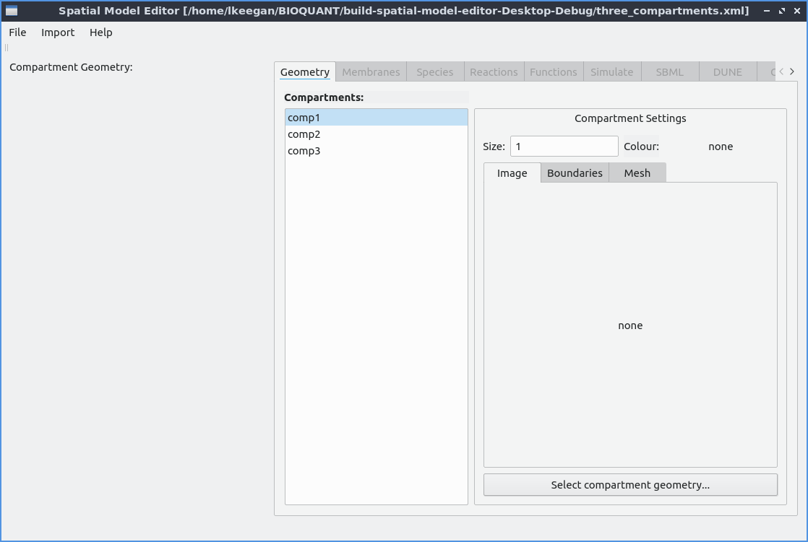

# Spatial Model Editor    

GUI spatial model editor prototype

  - Download the latest executable here: , , 
  - See the [documentation](https://spatial-model-editor.readthedocs.io/en/latest/)

## WP1a
Allow the user to describe a spatial model: [WP1a status](https://github.com/lkeegan/spatial-model-editor/projects/1)

(a partial re-implementation of the spatial model editing part of https://github.com/fbergmann/edit-spatial using C++/Qt5, with all dependencies statically linked so that it can be supplied as a stand-alone compiled executable for linux, windows and osx.)

## WP1b
Translate the spatial model to a system of PDEs: [WP1b status](https://github.com/lkeegan/spatial-model-editor/projects/2)

## Implementation details

  - _CI_: each commit is automatically compiled and tested on each supported OS:
    - linux & osx: https://travis-ci.org/lkeegan/spatial-model-editor
    - windows: https://ci.appveyor.com/project/lkeegan/spatial-model-editor
  - _Deployment_: tagged commits also result in a binary executable for each OS which are added to the release
  - _Dependencies_: the result is a standalone GUI executable that includes these statically linked libraries:
    - libSBML http://sbml.org/Software/libSBML [license: [LGPL](http://sbml.org/Software/libSBML/LibSBML_License)]
      - using pre-compiled binaries from https://github.com/lkeegan/libsbml-static
      - also includes the Expat XML library: https://github.com/libexpat/libexpat [license: [MIT](https://github.com/libexpat/libexpat/blob/master/expat/COPYING)]
    - Qt 5.12 LTS https://www.qt.io/qt-5-12 [license: [LGPL](https://doc.qt.io/qt-5/lgpl.html)]
      - using pre-compiled binaries from https://github.com/lkeegan/qt5-static
    - QCustomPlot 2.0.1 https://www.qcustomplot.com [license: GPL]
      - included in source code
    - ExprTK math parsing/evaluation library: https://github.com/ArashPartow/exprtk [license: MIT]
      - included in source code
    - Catch2 testing framework: https://github.com/catchorg/Catch2 [license: BSL-1.0]
      - included in tests source code
