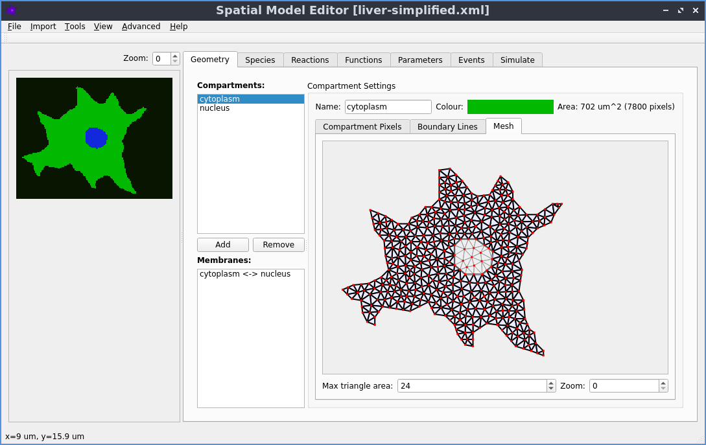

# Spatial Model Editor

A GUI editor to create and edit 2d spatial SBML models of bio-chemical reactions and simulate them using the
[dune-copasi](https://dune-copasi.netlify.app/) solver for reaction-diffusion systems.

To get started, download and run the GUI for your operating system

| [Linux](../../releases/latest/download/spatial-model-editor) | [MacOS](../../releases/latest/download/spatial-model-editor.dmg) | [Windows](../../releases/latest/download/spatial-model-editor.exe) |
| :-----: | :-----: | :------- |
|  |  |  |

Or take a look at our [website](https://spatial-model-editor.github.io/) or the [documentation](https://spatial-model-editor.readthedocs.io/)

Pre-release [preview binaries](https://github.com/spatial-model-editor/spatial-model-editor/releases/tag/latest) are also available for testing new features before the next release.

*Note: on linux some additional system libraries are required that may not be installed by default. To install them:*

*  Fedora/RHEL/CentOS: `sudo yum install xcb-util-image xcb-util-keysyms xcb-util-renderutil xcb-util-wm`

## Contributing

[Bug reports](https://github.com/spatial-model-editor/spatial-model-editor/issues/new?assignees=&labels=&template=bug_report.md) and [feature requests](https://github.com/spatial-model-editor/spatial-model-editor/issues/new?assignees=&labels=&template=feature_request.md) are very welcome, as are fixes or improvements to the [documentation](https://spatial-model-editor.readthedocs.io/) (to edit a page in the documentation, click the 'Edit on GitHub' button in the top right).

If you are interested in contributing code, please see the [contributing guidelines](.github/CONTRIBUTING.md).

## Dependencies

Spatial Model Editor makes use of the following open source libraries:

- [dune-copasi](https://gitlab.dune-project.org/copasi/dune-copasi) - license: [GPL2 + runtime exception](https://dune-project.org/about/license/)

- [libSBML](http://sbml.org/Software/libSBML) - license: [LGPL](http://sbml.org/Software/libSBML/LibSBML_License)

- [Qt](https://www.qt.io/) - license: [LGPL](https://doc.qt.io/qt-6/lgpl.html)

- [QCustomPlot](https://www.qcustomplot.com) - license: [GPL](https://www.gnu.org/licenses/gpl-3.0.html)

- [spdlog](https://github.com/gabime/spdlog) - license: [MIT](https://github.com/gabime/spdlog/blob/v1.x/LICENSE)

- [fmt](https://github.com/fmtlib/fmt) - license: [MIT](https://github.com/fmtlib/fmt/blob/master/LICENSE.rst)

- [SymEngine](https://github.com/symengine/symengine) - license: [MIT](https://github.com/symengine/symengine/blob/master/LICENSE)

- [LLVM Core](https://llvm.org/) - license: [Apache 2.0 License with LLVM exceptions](https://llvm.org/docs/DeveloperPolicy.html#copyright-license-and-patents)

- [GNU Multiple Precision Arithmetic Library](https://gmplib.org/) - license: [LGPL](https://www.gnu.org/licenses/lgpl-3.0.html)

- [GNU MPFR](https://www.mpfr.org/) - license: [LGPL](https://www.gnu.org/licenses/lgpl-3.0.html)

- [Computational Geometry Algorithms Library](https://www.cgal.org/) - license: [GPL](https://www.gnu.org/licenses/gpl-3.0.html)

- [Boost](https://www.boost.org/) - license: [boost](https://www.boost.org/users/license.html)

- [muParser](https://github.com/beltoforion/muparser) - license: [MIT](https://github.com/beltoforion/muparser/blob/master/License.txt)

- [libTIFF](http://www.libtiff.org/) - license: [MIT](http://www.libtiff.org/misc.html)

- [Expat](https://github.com/libexpat/libexpat) - license: [MIT](https://github.com/libexpat/libexpat/blob/master/expat/COPYING)

- [oneTBB](https://github.com/oneapi-src/oneTBB) - license: [Apache-2.0](https://github.com/oneapi-src/oneTBB/blob/master/LICENSE.txt)

- [Open Source Computer Vision Library](https://github.com/opencv/opencv) - license: [Apache-2.0](https://github.com/opencv/opencv/blob/master/LICENSE)

- [pybind11](https://github.com/pybind/pybind11) - license: [BSD-style](https://github.com/pybind/pybind11/blob/master/LICENSE)

- [Catch2](https://github.com/catchorg/Catch2) - license: [BSL-1.0](https://github.com/catchorg/Catch2/blob/master/LICENSE.txt)

- [Cereal](https://github.com/USCiLab/cereal) - license: [BSD](https://github.com/USCiLab/cereal/blob/master/LICENSE)

- [zlib](https://zlib.net/) - license: [zlib](https://zlib.net/zlib_license.html)

- [bzip2](https://www.sourceware.org/bzip2/) - license: [BSD-style](https://sourceware.org/git/?p=bzip2.git;a=blob;f=LICENSE;h=81a37eab7a5be1a34456f38adb74928cc9073e9b;hb=6a8690fc8d26c815e798c588f796eabe9d684cf0)

- [pagmo](https://esa.github.io/pagmo2/index.html) - license: [GPL](https://github.com/esa/pagmo2/blob/master/COPYING.gpl3)

## Licensing Note

The source code in this repository is released under the MIT license, which is a permissive
[GPL-compatible](https://www.gnu.org/licenses/gpl-faq.html#WhatDoesCompatMean) license.

The open source libraries that it uses are either also released under a permissive GPL-compatible license, or
under a GPL license. As described in the [gpl-faq](https://www.gnu.org/licenses/gpl-faq.html#IfLibraryIsGPL),
this means that the work as a whole is then licensed under the GPL.
