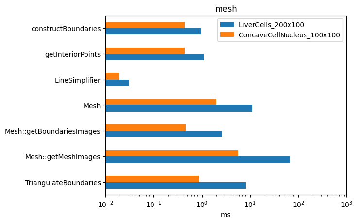
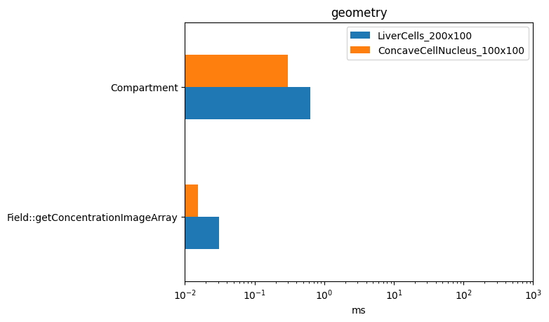
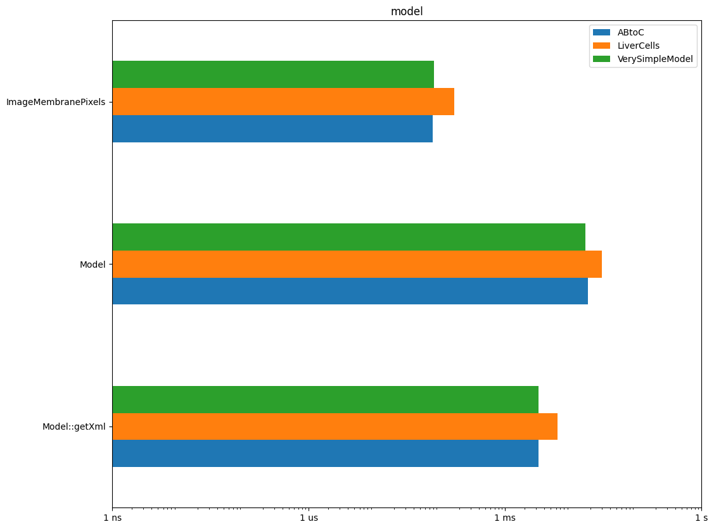
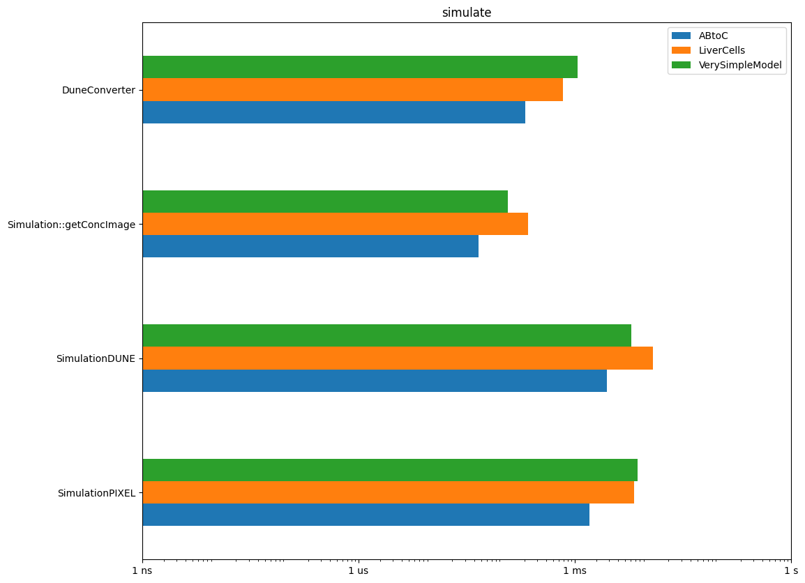

# Benchmarks

- benchmarks for a component `X.cpp` are located in the same directory
in `X_bench.cpp`.
- [update_benchmarks.sh](update_benchmarks.sh) is a simple script to run
  the benchmarks and generate these plots

