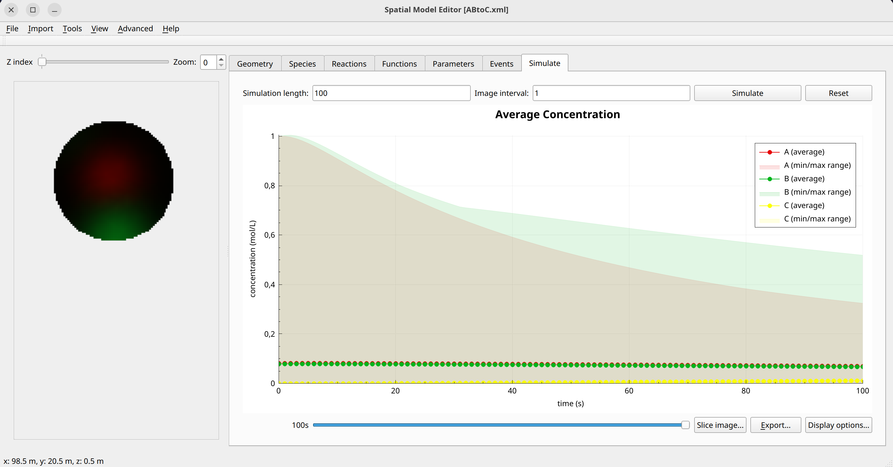

AB-to-C Reaction model
======================
This is a simple toy model that describes the conversion of two species A and B into a third species C, and showcases how to use the stoichiometry option to define reaction terms between species in the bulk volume of compartments.

Formulation
"""""""""""

.. math::

    &\frac{\partial A}{\partial t} = D_{A} \nabla^2 A - r(A,B,C)

    &\frac{\partial B}{\partial t} = D_{B} \nabla^2 B - r(A,B,C)

    &\frac{\partial C}{\partial t} = D_{C} \nabla^2 C + r(A,B,C)

    & r(A,B,C) = k_{1} A B

Example Snapshot
"""""""""""""""""

