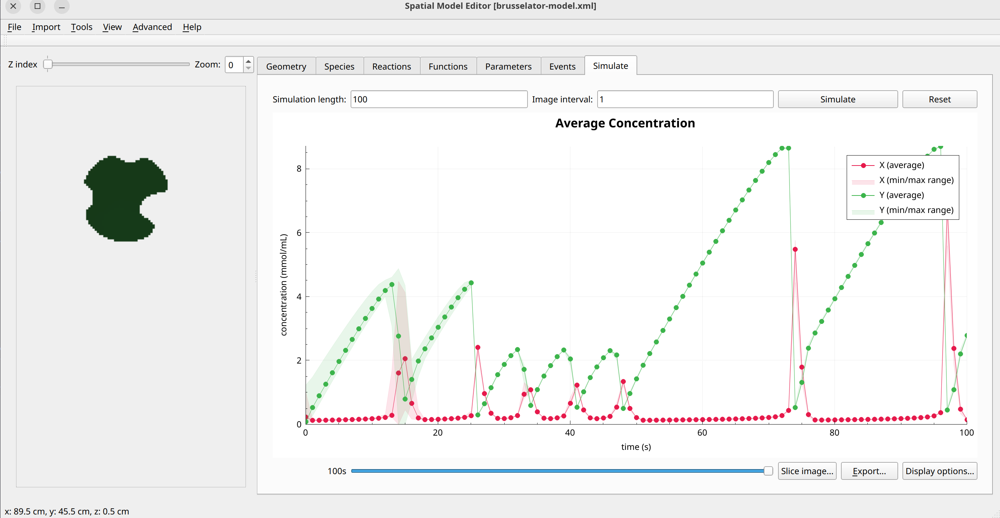

Brusselator model 
==================

Formulation
"""""""""""

.. math::
    &\frac{\partial A}{\partial t} = D_{A} \nabla^2 A
    &\frac{\partial B}{\partial t} = D_{B} \nabla^2 B
    &\frac{\partial C}{\partial t} = D_{C} \nabla^2 C

Example Snapshot
"""""""""""""""""
