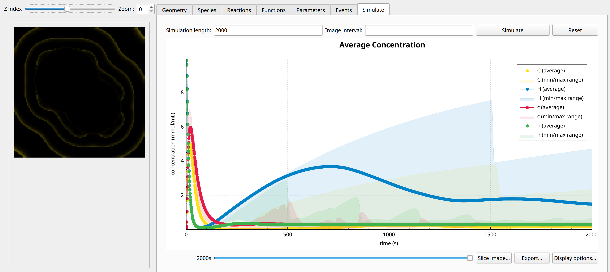

Calcium-Wave-Propagation Model
==============================
This system aims to simulate calcium wave propagation, which plays a role in intracellular signalling in many cells. :math:`c_{i}` represents the local calcium concentration and :math:`h_{i}` the gating variable which abstracts other cellular state variables relevant for calcium release. Hence, :math:`h_{i}` has no diffusion term. As always, the :math:`k_{i}` define the reaction parameters. It is defined in a 3D cube (domain 2) with an inset subdomain consisting of 2 partially intersecting spheres (domain 1). The parameters are set to the same values in both domains and are homogeneous throughout.
With the predefined parameters, the inner domain feeds outward propagating calcium waves in the outer domain.

Formulation
""""""""""""""
.. math::
    &\frac{\partial c_{i}}{\partial t} = D_{c_{i}} \nabla^2 c_{i} + \frac{k_{1} c_{i}^{2} h_{i}}{k_{2} + c_{i}^{2}} - k_{3} c_{i}

    &\frac{\partial h_{i}}{\partial t} = \epsilon \left( k_{1} - k_{5} h_{i} - \frac{k_{1} c_{i}^{2} h_{i}}{k_{2} + c_{i}^{2}} \right)

    &j_{c, 1 \rightarrow 2} = k c_{1}

    &j_{c, 2 \rightarrow 1} = k c_{2}

    &j_{h, 1 \rightarrow 2} = 0

    &j_{h, 2 \rightarrow 1} = 0

Example snapshot:
^^^^^^^^^^^^^^^^^

