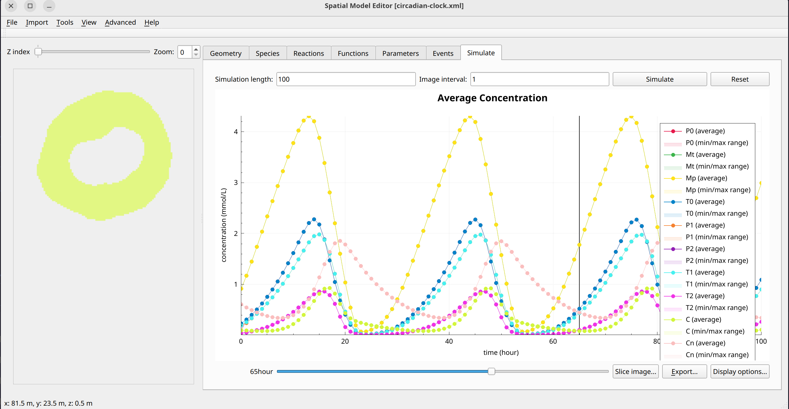

Circadian clock
===============
This model is based on the paper `Chaos and birhythmicity in a model of circadian oscillations of the PER and TIM proteins in Drosophila <http://utc.ulb.be/ARTICLES/1999_Leloup_JTB.pdf>`_ by Leloup and Goldbeter which has been made into a spatial reaction diffusion model. It defines over 30 reactions between 10 species in a single compartment without membrane effects.
Due to the complexity of the mathematical description, it is not given in full here.

Example Snapshot
"""""""""""""""""

