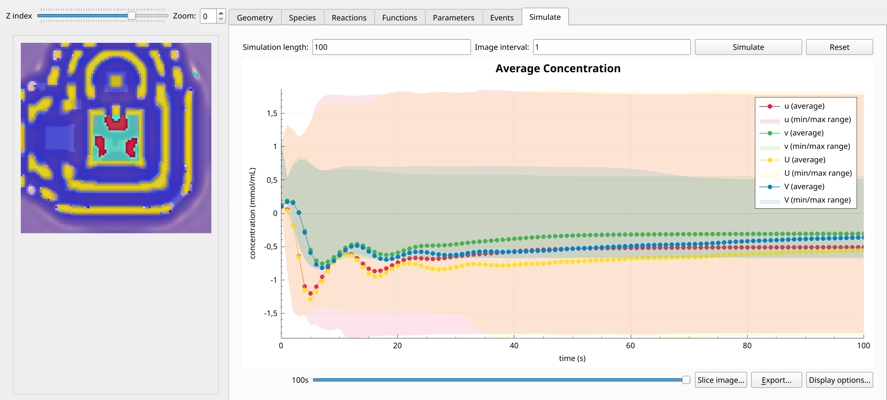

FitzHugh-Nagumo
===============
An implementation of the `FitzHugh-Nagumo reaction-diffusion system <https://en.wikipedia.org/wiki/FitzHugh%E2%80%93Nagumo_model>`_. The model consists of two chemical species which diffuse and react with each other in such a way that one species acts as an activator and the other as inhibitor of the reaction. These are defined in each subdomain, while the parameters are homogeneous throughout.
For the predefined parameters, the model produces travelling waves.
The model is defined on a 3D domain cube (domain 2) with an inset consisting of two pyramids touching at the tip (domain 1).

Formulation
"""""""""""

.. math::
        &\frac{\partial u_{i}}{\partial t} = D_{u_{i}} \nabla^2 u_{i} + u_{i} - u_{i}^3 - v_{i} + I

        &\frac{\partial v_{i}}{\partial t} = D_{v_{i}} \nabla^2 v_{i} + \epsilon \left( u_{i} + \beta - \gamma v_{i} \right)

        &j_{u, 1 \rightarrow 2} = k u_{1} v_{2}

        &j_{u, 2 \rightarrow 1} = k \alpha u_{2}^{2}

        &j_{v, 1 \rightarrow 2} = k u_{2} v_{1}

        &j_{v, 2 \rightarrow 1} = \beta v_{1}^{2}

Example snapshot:
^^^^^^^^^^^^^^^^^

