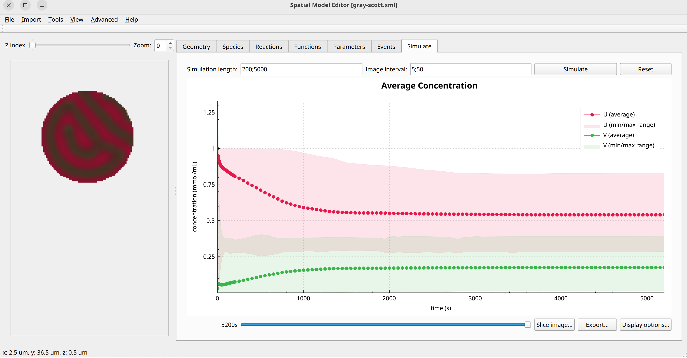

Gray Scott
==========
The Gray Scott model is a classic reaction-diffusion model exhibiting pattern formation, popularized in the articles `Complex Patterns in a Simple System <https://www.science.org/doi/10.1126/science.261.5118.189>`_ and `Pattern Formation by Interacting Chemical Fronts <https://www.science.org/doi/10.1126/science.261.5118.192>`_. The model consists of two speces :math:`u` and :math:`v` that react and diffuse in a single compartment. :math:`k1`, :math:`k` and :math:`f` are reaction parameters, :math:`Du` and :math:`Dv` are diffusion coefficients. This system a good starting point to explore parameterizations and the effect this has on nonlinear reaction-diffusion systems.

Formulation
""""""""""""""
   .. math::

      &\frac{\partial u}{\partial t} = D_{u} \nabla^2 u - k_{1} u v^{2} + f \left(1-u \right)

      &\frac{\partial v}{\partial t} = D_{v} \nabla^2 v + k_{1} u v^{2} - \left( f + k \right) v

Example Snapshot
"""""""""""""""""

