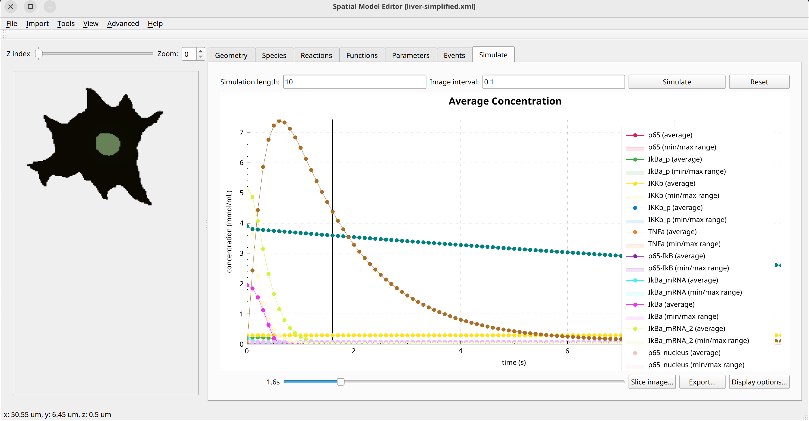

Simplified liver model
======================
This model is a simplified, spatial version of the model introduced in `A systems biology study on NFκB signaling in primary mouse hepatocytes <https://doi.org/10.1371/journal.pone.0021489>`_. This illustrates the use of SME beyond simple toy models. Keep in mind however that this model is for illustration, with physical accuracy not being the main goal.
It features 14 species and 23 reactions over 2 compartments and an interface between them with 30 parameters and makes use of the function definition system to simplify expressions. Because of this complexity, the mathematical formulation is not shown here.

Example Snapshot
"""""""""""""""""

   The last timestep of the simplified liver model in a 2D domain.
