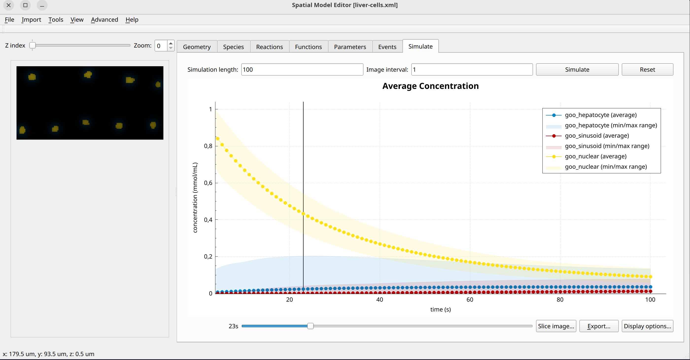

Liver cells
===========
This model uses a more complex 2D geometry than seen before that consists of a row of cells at the top and bottom of the domain with a undulating channel inbetween and gaps between the cells. Each cell additionally has a nucleus. 

This model can serve as a playground,e.g., for working with exchange processes complicated geometries. The mathematical model is geared towards simplicity and does not represent a real physical system. There is one species :math:`g` which exists in all three compartments `nuclear`, `sinosoid` and `hepatocyte`.
There are no bulk reactions, only membrane fluxes and diffusion in the bulk volume, which has the same form everywhere. In the following, the abbreviations nuclear (n), sinosoid (s), hepatocyte (h) are used.

Formulation
""""""""""""""
.. math::
   &\frac{\partial g_{n,s,h}}{\partial t} = D_{g_{n,s,h}} \nabla^2 g_{n,s,h}

   &j_{g, h \rightarrow s} = 

   &j_{g, n \rightarrow h} = 

   
Example Snapshot
"""""""""""""""""

