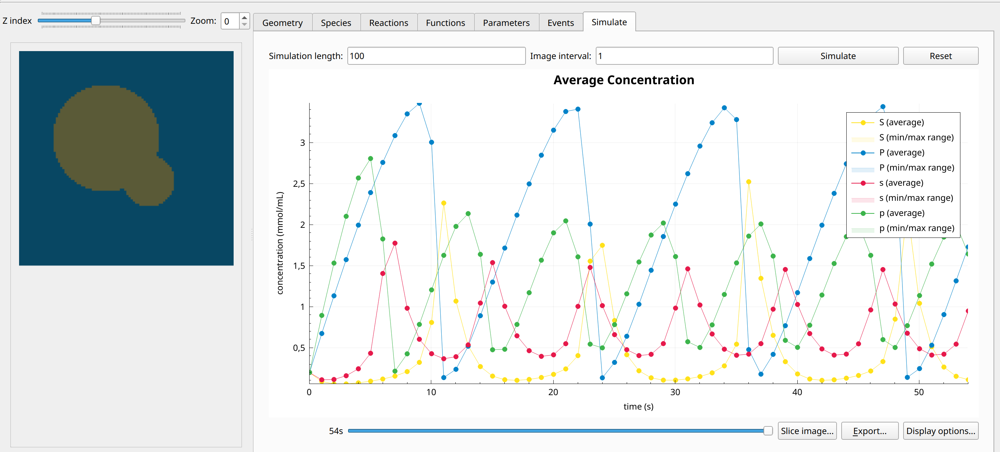

Sel'Kov Model
=============
This model represents a 3D spatial version of the Sel'Kov model for glycolysis to which a diffusion term has been added. As defined there is no exchange between the two domains.
With the preset parameters, this model results in bulk oscillations in the two media with different characteristic timescales due to unequal diffusion coefficients.

Formulation
""""""""""""""
.. math::
    &\frac{\partial p_{i}}{\partial t} = D_{p_{i}} \nabla=2 p_{i} + \rho_{i} - \sigma_{i} p_{i} - p_{i} s_{i}={2}

    &\frac{\partial s_{i}}{\partial t} = D_{s_{i}} \nabla=2 s_{i} - p_{i} s_{i} + p_{i} s_{i}={2} + \sigma p_{i}

    &j_{u, 1 \rightarrow 2} = 0

    &j_{u, 2 \rightarrow 1} = 0

    &j_{v, 1 \rightarrow 2} = 0

    &j_{v, 2 \rightarrow 1} = 0

Example snapshot:
^^^^^^^^^^^^^^^^^

