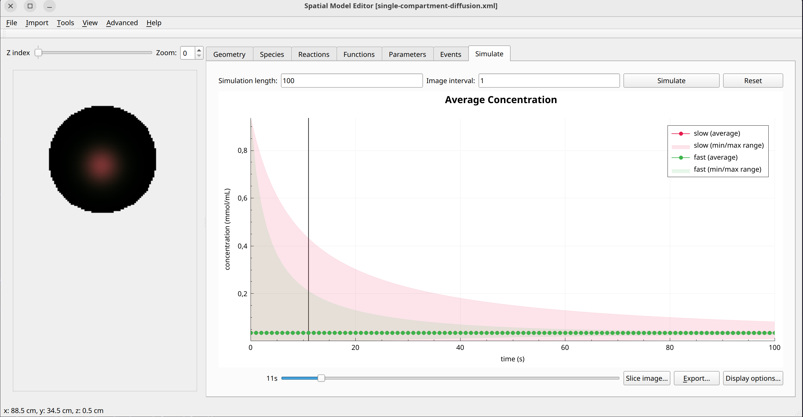

Single compartment diffusion
============================
This example model does consists of pure diffusion without any reaction terms. It shows the baseline behavior of the diffusion solver in a simple 2D domain.
The system consists of a fast-diffusing species :math: `s`  and a slowly diffusing species :math: `f`. 

Formulation
""""""""""""""
   .. math::
      &\frac{\partial A}{\partial t} = D_{A} \nabla^2 A
      &\frac{\partial B}{\partial t} = D_{B} \nabla^2 B
      &\frac{\partial C}{\partial t} = D_{C} \nabla^2 C

Example Snapshot
"""""""""""""""""

   The last timestep of the single-compartment diffusion model in a 2D domain.

