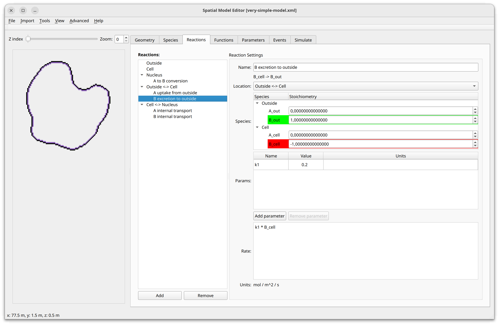
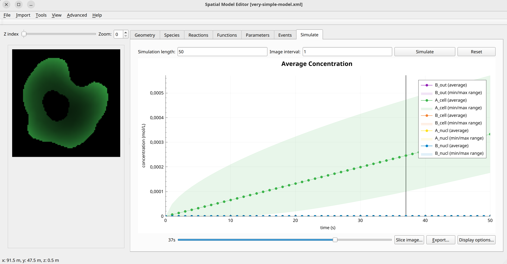

A very simple model
======================
This models a simple system in which two species :math:`A` and :math:`B` react in a compartment and are exchanged across membranes that separate a cell from and outside volume and the cell nucleus from the cytoplasm. It shows how to define membrane reactions and how to use stoichiometric coefficients to define the direction of exchange between compartments.
To become familiar with this, play around with the stoichiometric coefficients in the reaction definition and observe how the reaction label below the reaction name in the GUI changes when you change their sign. Check which term in the mathematical formulation below corresponds to what part of the reaction definition in the GUI, and how the two representations differ.
This model comes in a 2D and a 3D version.

In the formulation below, the index :math:`i` refers to compartments (nucleus, cytoplasm, outside).

Formulation in the bulk volume of each compartment
""""""""""""""""""""""""""""""""""""""""""""""""""

.. math::

    &\frac{\partial A_{i}}{\partial t} = D_{A_{i}} \nabla^2 A_{i} - k_{1} A_{i}

    &\frac{\partial B_{i}}{\partial t} = D_{B_{i}} \nabla^2 B_{i} + k_{1} A_{i}

Formulation for the exchange between compartments
"""""""""""""""""""""""""""""""""""""""""""""""""

.. math::

    &j_{A, nuc \rightarrow cell} = - \left(k_{2} A_{nuc} - k_{1} A_{Cell} \right)

    &j_{B, nuc \rightarrow cell} = k_{1} B_{nuc}

    &j_{A, cell \rightarrow outside} = - k_{1} A_{out}

    &j_{B, cell \rightarrow outside} = k_{1} B_{cell}

Example Snapshots
"""""""""""""""""

    Note how the arrow in the label under the reaction name indicates the direction of the exchange. Try experimenting with the stoichiometric coefficients to see how they affect the exchange between compartments.

    Screenshot of the result of running the very simple example model in 2D
