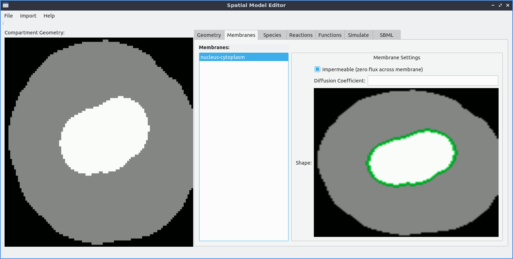

Membrane Properties
===================

If two compartments touch each other, the GUI identifies their common boundary as a *membrane*. The Membrane tab contains a list of all such identified membranes.

By default, membranes are assumed to be impermeable (the same as any other boundary, i.e. the zero flux Neumann boundary condition is applied on both sides.)

If desired, the user can instead make the membrane porous, and specify the diffusion coefficient for the membrane. This will result in a non-zero Neumann boundary condition where the flux is given by the difference in concentration on either side of the membrane multiplied by the diffusion coefficient.

   An example of making a membrane between two compartments porous.
