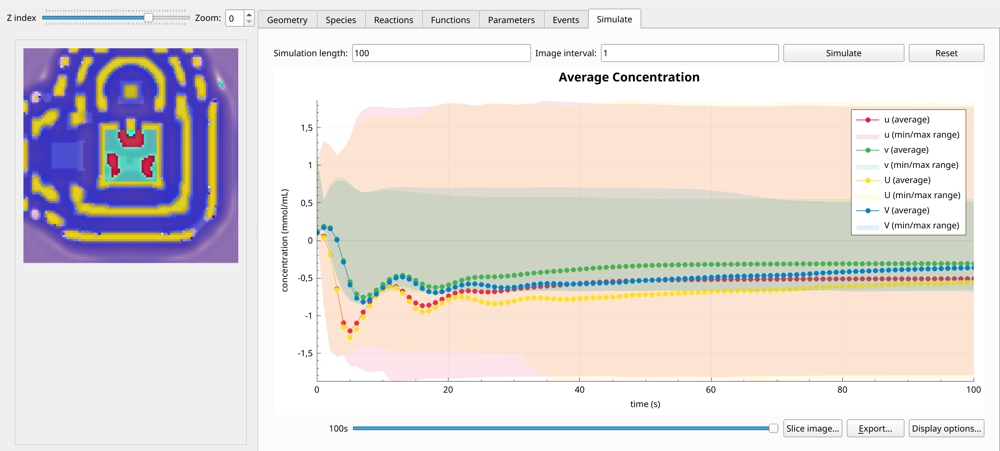
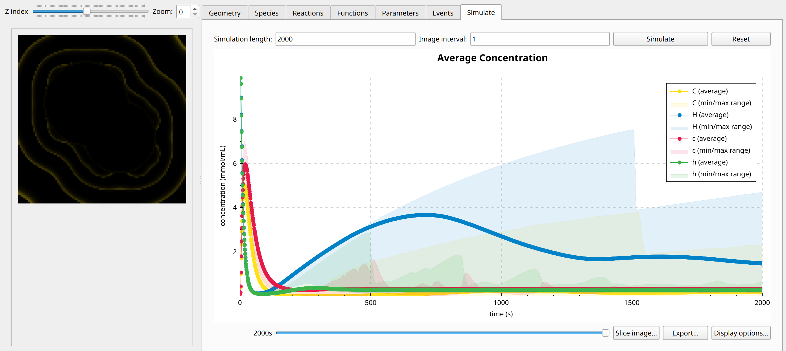
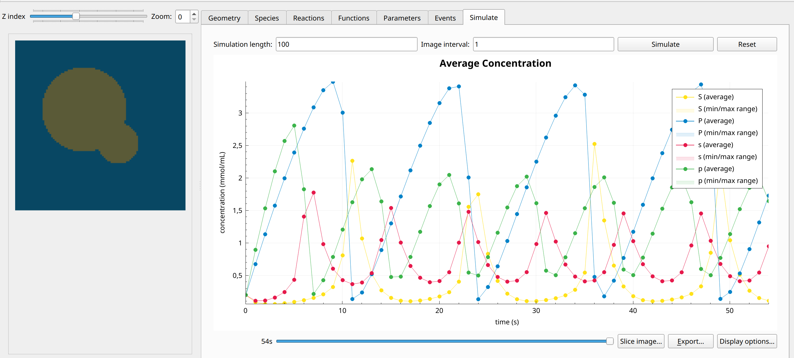

Example Models
==============

Spatial-Model-Editor contains a number of example models for 2D and 3D domains which showcase different use-cases and features of the software.
These models can be run from the `File->Open example model` menu.

FitzHugh-Nagumo
---------------
An implementation of the FitzHugh-Nagumo reaction-diffusion system. The model consists of two chemical species which diffuse and react with each other in such a way that one species acts as an activator and the other as inhibitor of the reaction. These are defined in each subdomain, while the parameters are homogeneous throughout.
For the predefined parameters, the model produces travelling waves.
The model is defined on a 3D domain cube (domain 2) with an inset consisting of two pyramids touching at the tip (domain 1).

Formulation
^^^^^^^^^^^
.. math::
        &\frac{\partial u_{i}}{\partial t} = D_{u_{i}} \nabla^2 u_{i} + u_{i} - u_{i}^3 - v_{i} + I

        &\frac{\partial v_{i}}{\partial t} = D_{v_{i}} \nabla^2 v_{i} + \epsilon \left( u_{i} + \beta - \gamma v_{i} \right)

        &j_{u, 1 \rightarrow 2} = k u_{1} v_{2}

        &j_{u, 2 \rightarrow 1} = k \alpha u_{2}^{2}

        &j_{v, 1 \rightarrow 2} = k u_{2} v_{1}

        &j_{v, 2 \rightarrow 1} = \beta v_{1}^{2}

Example snapshot:
^^^^^^^^^^^^^^^^^

Calcium-Wave-Propagation Model
------------------------------
This system aims to simulate calcium wave propagation, which plays a role in intracellular signalling in many cells. :math:`c_{i}` represents the local calcium concentration and :math:`h_{i}` the gating variable which abstracts other cellular state variables relevant for calcium release. Hence, :math:`h_{i}` has no diffusion term. It is defined in a 3D cube (domain 2) with an inset subdomain consisting of 2 partially intersecting spheres (domain 1). The parameters are set to the same values in both domains and are homogeneous throughout.
With the predefined parameters, the inner domain feeds outward propagating calcium waves in the outer domain.

Formulation
^^^^^^^^^^^
.. math::
    &\frac{\partial c_{i}}{\partial t} = D_{c_{i}} \nabla^2 c_{i} + \frac{k_{1} c_{i}^{2} h_{i}}{k_{2} + c_{i}^{2}} - k_{3} c_{i}

    &\frac{\partial h_{i}}{\partial t} = \epsilon \left( k_{1} - k_{5} h_{i} - \frac{k_{1} c_{i}^{2} h_{i}}{k_{2} + c_{i}^{2}} \right)

    &j_{c, 1 \rightarrow 2} = k c_{1}

    &j_{c, 2 \rightarrow 1} = k c_{2}

    &j_{h, 1 \rightarrow 2} = 0

    &j_{h, 2 \rightarrow 1} = 0

Example snapshot:
^^^^^^^^^^^^^^^^^

Sel'Kov Model
-------------
This model represents a 3D spatial version of the Sel'Kov model for glycolysis to which a diffusion term has been added. As defined there is no exchange between the two domains.
With the preset parameters, this model results in bulk oscillations in the two media with different characteristic timescales due to unequal diffusion coefficients.

Formulation
^^^^^^^^^^^
.. math::
    &\frac{\partial p_{i}}{\partial t} = D_{p_{i}} \nabla^2 p_{i} + \rho_{i} - \sigma_{i} p_{i} - p_{i} s_{i}^{2}

    &\frac{\partial s_{i}}{\partial t} = D_{s_{i}} \nabla^2 s_{i} - p_{i} s_{i} + p_{i} s_{i}^{2} + \sigma p_{i}

    &j_{u, 1 \rightarrow 2} = 0

    &j_{u, 2 \rightarrow 1} = 0

    &j_{v, 1 \rightarrow 2} = 0

    &j_{v, 2 \rightarrow 1} = 0

Example snapshot:
^^^^^^^^^^^^^^^^^

