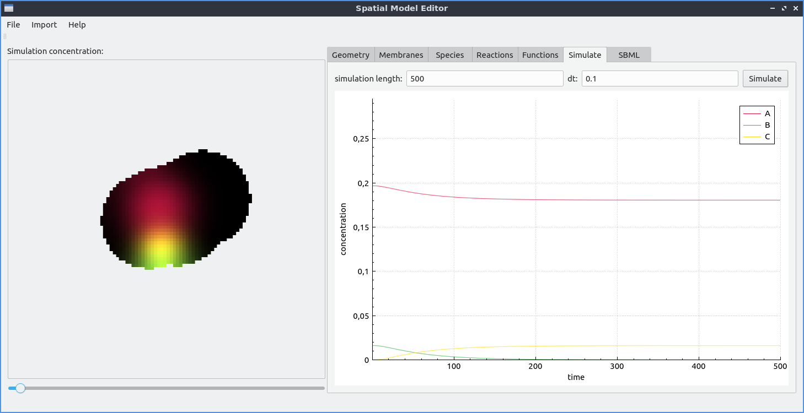

Find your bearings
==================
Welcome to the spatial-model-editor (SME)!
This guide will help you get started with the graphical user interface of spatial-model-editor.
For this to make sense, we need to understand the basic model structure first.

Model structure in spatial-model-editor
---------------------------------------
A model in spatial-model-editor consists of five basic parts which all must be defined in order to run a simulation:

#. A definition of the spatial domain the model should run on. This can be 2D or 3D and can be divided into an arbitrary number of compartments which have interfaces with each other. In the cellular context that is relevant here, these interfaces can represent membranes between cell compartments or cells.

#. A set of chemical species whose concentration is defined in different compartments. These concentrations are assumed to undergo diffusion by default.
These chemical species need to have an initial distribution of concentration in the compartments they are defined in and an isotropic, homogeneous diffusion constant.

#. The chemical reactions that can occur between the different species. These can be devided into reactions in the volume of the compartments and fluxes and reactions that only happen on the interfaces between compartments.

#. The chemical reactions between species typically come with a number of parameters that we need to set to defined numerical values. Often, these define the rates at which a reaction occurs.

#. How the model equations defined in the last three steps should be solved numerically in space and time. This means we have to choose a time interval in which to solve the equations and algorithm to do so.

The graphical user interface of spatial-model-editor follows this basic structure. For each of the steps, there is a tab in the main window that allows you to define the corresponding part of the model. Additional configuration for each step is available via the menu bar at the top of the main window.

   The main window of the spatial-model-editor. The five tabs at in the upper center correspond to the five parts of the model that need to be defined.

In the following, you will learn how to define your own model in spatial-model-editor by following the above scheme.
If instead you are more interested in turning an existing non-spatial model defined in COPASI or SBML into a spatial model and run it via spatial-model-editor, you can skip ahead and go the respective `user guide <work_with_SBML_COPASI.html>`_ right away. However, we recommend to work through this guide once because parts of it are needed to make predefined ODE models work in spatial-model-editor, too.
