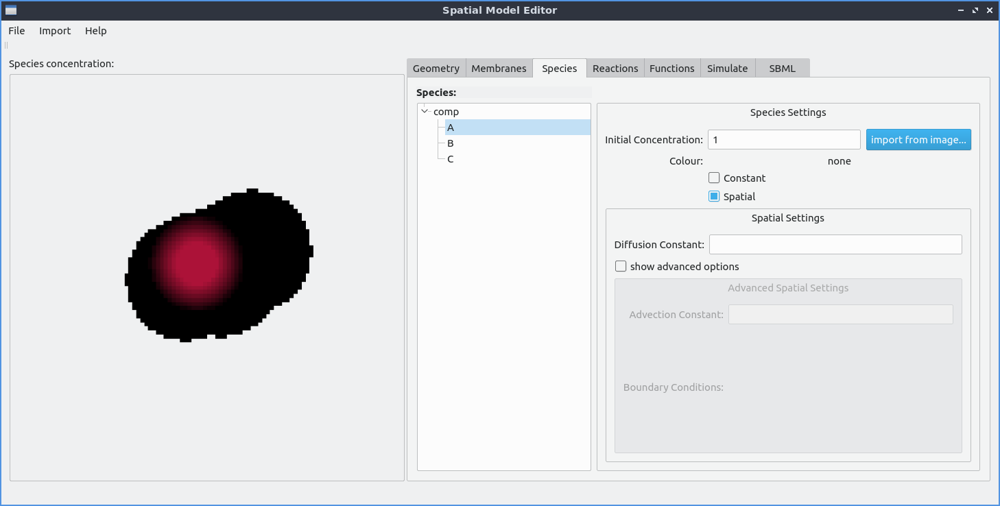

Importing Concentration
=======================

In the Species tab, the species in each compartment are listed.

Clicking on a species from this list displays the species concentration and other settings.

To import a spatial concentration from an image, ensure the `Spatial` checkbox is enabled in the settings for the selected species, then click on "import from image...".

   An example of importing a spatial distribution of species concentration from an image. The image used in this example can be downloaded `here <https://raw.githubusercontent.com/lkeegan/spatial-model-editor/master/examples/concentration/one-blob-100x100.bmp>`_.
