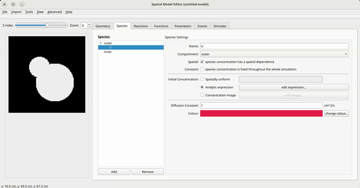

Species properties
==================
The next step is to define the chemical species present in the system. To do this, click on the `species` tab.
On the left, you see a list of compartments in the model geometry. Select the one for which you want to define species. This species will only exist in this compartment. As a consequence, even if the species in all compartments are chemically the same, you still have to define them separately. Species only exist in the bulk volume of the compartments, i.e., species cannot be present only on the membranes.

To create a new species, click the `Add` button, select a suitable name, and hit enter. The new species will appear below the compartment name.

On the right hand side, you see the Species Settings menu. Here you can define all relevant properties of the species.

At the top, you can rename the species or assign it to a different compartment. You can also select whether it should be constant for the whole simulation or be variable. Constancy may be a useful simplifying assumption in some models if, for example, the species is produces far more quickly than the characteristic simulation timescale.

   How to define a new species in a compartment together with its initial conditions and diffusion constant

Two more properties of a species are of primary importance.

:Initial concentration:
   This can be set to a constant value, an analytic expression over the spatial coordinates `x` and `y` (and `z` for 3D images) or it can be derived from an image that's loaded from disk, in the .png format for 2D domains, and as .tiff file for 3D domains.

:Diffusion constant: The presence of a diffusion term

   .. math::

         D \nabla^{2} c_{i}

   is always assumed by default (see the `documentation on the mathematical formulation <../reference/maths.html>`_ for more details). The diffusion constant `D` is assumed to be isotropic and homogeneous. If you don't want diffusion to be present, set this constant to zero.

With the definition of these two elements, the species is fully defined and can be used in the next steps of the model definition.

.. note::
   Take care to get the units correct. All quantities are assumed to have certain SI units, which are noted next to the input field for the respective quantity. For example, the diffusion constant could have units of :math: `cm^2/s`. For more on units, `see here <../reference/units.html>`_.

.. figure:: img/concentration.apng
   :alt: screenshot showing species concentration settings

   An example of different ways to specify the initial spatial distribution of a species concentration.
