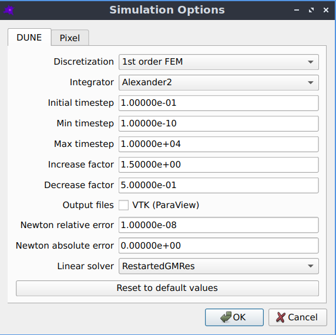

dune-copasi simulator
=====================

`dune-copasi <https://dune-copasi.netlify.app/>`_ is the default PDE solver,
which solves the PDE on a triangular mesh using finite element discretization methods.
The mesh is automatically constructed from the geometry image, as described in :doc:`mesh`.

Simulation options
------------------

The default settings should work well in most cases, but if desired they can be adjusted by going to `Advanced->Simulation options`

   The simulation options that can be used to fine tune-the dune-copasi solver.

* Discretization
   * currently only 1st order FEM is supported
   * other discretizations (such as 2nd order FEM) may be added in the future
* Integrator
   * the Runge-Kutta integration scheme used for time integration
   * a variety of implicit and explicit schemes of different orders are available
   * the default is the 2nd order Alexander scheme, which is a `Diagonally Implicit Runge Kutta <https://en.wikipedia.org/wiki/List_of_Runge%E2%80%93Kutta_methods#Diagonally_Implicit_Runge_Kutta_methods>`_ method
* Initial timestep
   * the timestep used at the start of a simulation
* Min timestep
   * the minimum allowed timestep
   * for a very stiff model it may be necessary to reduce this value
* Max timestep
   * the maximum allowed timestep
   * reducing this value may increase the accuracy of the solution but simulations will take longer to run
* Increase factor
   * after a successful integration step, the timestep is multiplied by this factor
   * this must be greater than or equal to 1
   * if equal to 1, the timestep is never increased between integration steps
   * the larger the value, the more the timestep is increased after successful integration steps
* Decrease factor
   * if an integration step is unsuccessful, the timestep is multiplied by this factor and the step is repeated
   * this must be less than 1
   * the smaller the value, the more the timestep is decreased in the case of an unsuccessful integration step
* Output files
   * VTK files of the species concentrations throughout the simulation can be generated
   * these files can be viewed using `ParaView <https://www.paraview.org/>`_
* Newton relative error
   * the relative error where Newton iteration is considered to have converged
   * currently this may need to be altered depending on the units and geometry size (see `#315 <https://github.com/spatial-model-editor/spatial-model-editor/issues/315#issuecomment-760085781>`_)
* Newton absolute error
   * the absolute error where Newton iteration is considered to have converged
   * currently this may need to be altered depending on the units and geometry size (see `#315 <https://github.com/spatial-model-editor/spatial-model-editor/issues/315#issuecomment-760085781>`_)

For more information see the `dune-copasi documentation <https://dune-copasi.netlify.app/>`_.
