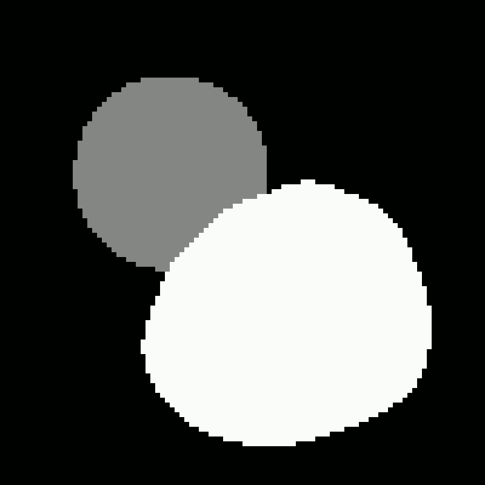
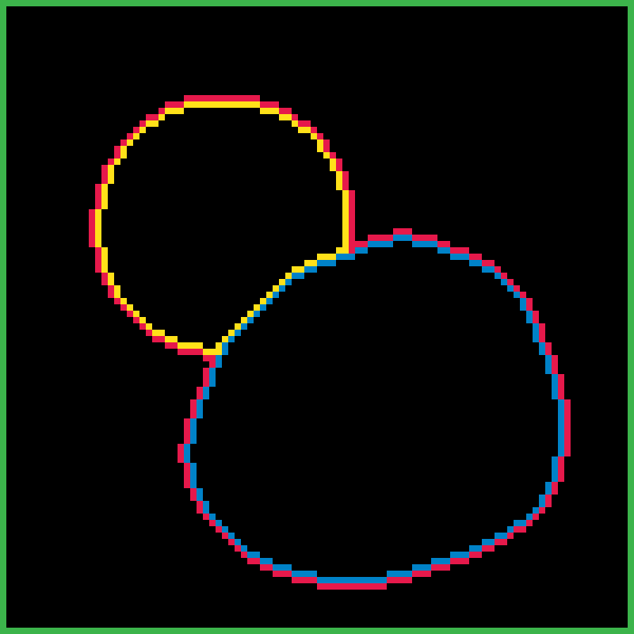
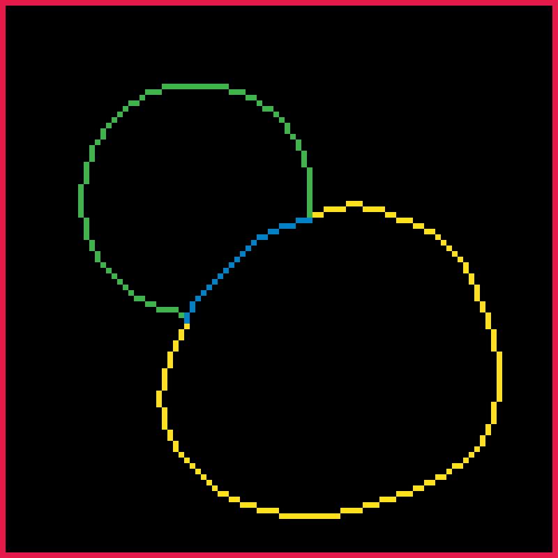
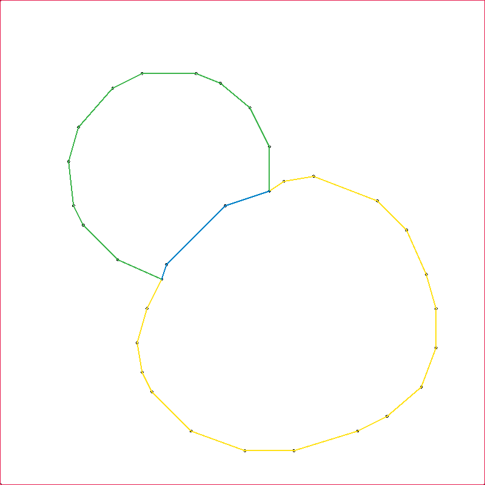
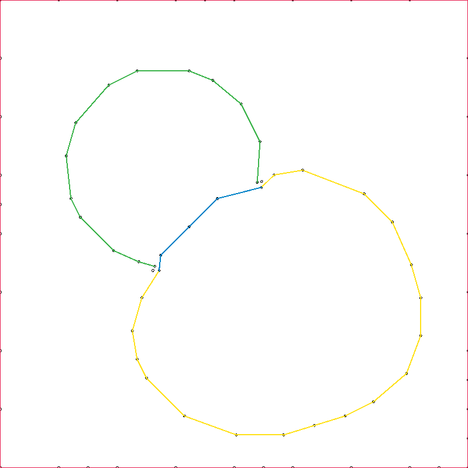
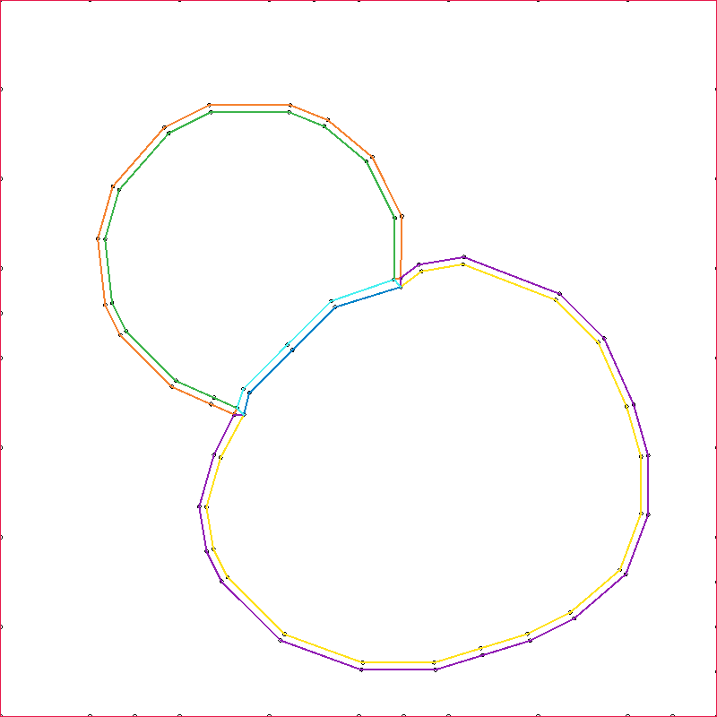
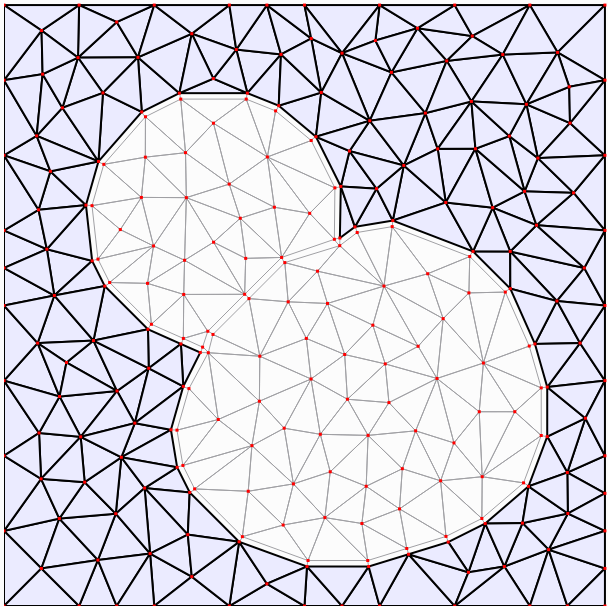

Mesh generation
===============

Generating a triangular mesh for the dune-copasi solver from a pixel image of the compartment geometry involves multiple steps:

- identify contours of compartment boundaries
- split contours into lines
- merge adjacent lines
- merge adjacent end points
- simplify boundary lines by removing points
- add Steiner points
- split membrane end points
- generate membrane compartments
- triangulate

These steps are described in more detail below, starting from this initial geometry image to illustrate each stage:

   Initial geometry image.

Contour detection
-----------------

The first step in generating the mesh is to identify the set of contours that make up the boundaries of each compartment. Each contour is a closed loop of connected pixels that makes up a boundary between a compartment and the rest of the model. Each compartment has at least one contour around its outer boundary, and it may also contain inner contours around any holes in the compartment shape.

The contour tracing is done using the `findContours <https://docs.opencv.org/2.4/modules/imgproc/doc/structural_analysis_and_shape_descriptors.html#findcontours>`_ routine from the `OpenCV <https://opencv.org/>`_ library, which implements the method described in `Suzuki et. al. <https://www.sciencedirect.com/science/article/abs/pii/0734189X85900167>`_. This method returns an ordered set of pixels for each contour. The outer contour traces the outer boundary in the anti-clockwise direction, while the inner contours trace each inner boundary in a clockwise direction.

   Boundary contours.

Contour splitting
-----------------

The contours are then split into lines which have a consistent neighbouring contour (including not having a neighbouring contour). For example, if part of contour `A` is adjacent to contour `B`, and the rest of contour A has no neighbouring contours, it will be split into two sections, one line for the part adjacent to contour `B`, and another line for the rest of the contour.

   Split boundary contours.

Contour merging
---------------

Next, adjacent contours need to be merged into a single boundary line. Adjacent contours are determined as the section of the appropriate contour with the smallest distance between the oriented pixels, and once a pair has been identified, one of the lines is removed to leave a single boundary line.

At the end of this step, we are left with a collection of boundary lines, some of which are closed loops, some not. All instances of adjacent contours have been replaced with a single boundary line of some kind.

   Split and merged boundary contours.

End point merging
-----------------

At places where three compartments meet, we would like to have three non-loop boundary lines meeting at a point. However, from the previous step, we will have three such lines that terminate near to each other, but typically separated by a pixel or two.

Here we take an end point, then determine the two closest other end points to it, and merge the three points. This is done until all such end point triplets have been merged. If the new end point is not adjacent to the end of the line, pixels are added in a straight line to connect the line to its new end point.

Note: currently we assume all end points come in triplets - ideally we should take into account possible 2- or 4-point merging.

   Merged boundary contours.

Boundary line simplification
----------------------------

Once we have identified all of our boundaries, we want to simplify them by removing points from the boundary. We do this using `Visvalingam-Whyatt polyline simplification <https://www.tandfonline.com/doi/abs/10.1179/000870493786962263>`_. The algorithm starts by calculating the area of the triangle formed by each point on the boundary with its two nearest neighbouring points. Then at each step:
- the point with the smallest area is removed
- the two neighbouring points areas are recalculated
- the larger of the previous and the new area is used
This allows us to order the points in the boundary by their order of importance, and then the user can adjust the number of points used for each boundary according to how accurately they wish the represent the original boundaries.

   Simplified boundary lines.

Steiner points
--------------

A long straight section of boundary will only have a start and end point. When we triangulate the area, we may need to insert more boundary points along these straight sections to satisfy limits on maximum triangle area. These points do not change the shape of the boundary, and are known as `Steiner points`.

Currently we determine the need for such points by performing a preliminary triangulation using our current boundary lines, and adding any Steiner points that were inserted as part of the triangulation. We use the `Triangle <https://www.cs.cmu.edu/~quake/triangle.html>`_ library to generate the triangular mesh. This generates a constrained conforming Delaunay triangulation (CCDT) from the boundary lines, by inserting points inside the compartments and triangulating them. If necessary it will also add aditional points on the boundary lines (known as Steiner points).

   Simplified boundary lines with Steiner points added.

End point splitting
-------------------

We currently require membrane boundaries to be represented by a quadrilateral mesh of single-element thickness. To construct the boundary lines for these membrane compartments, we first replace each end point of a membrane boundary line with a triplet of points equally distributed around the original point. The triangle formed by connecting these three points will form a void around the original end point in the final mesh, and is where the three membrane compartments will meet.

   Simplified boundary lines with split end points.

Membrane boundaries
-------------------

Now we can duplicate and shift each membrane boundary line in a perpendicular direction to form the boundaries of the membrane compartment, and then connect the start and end points of each of these lines to the appropriate point in the new triplet of points around each previous end point. They then form the boundaries of the membrane compartments.

   Simplified boundary lines with membrane compartment boundaries.

Mesh generation
---------------

Finally we are ready to generate the triangular mesh. We do this again using the `Triangle <https://www.cs.cmu.edu/~quake/triangle.html>`_ library, with the same maximum triangle area constraints as previously, but this time disallowing the creation of new Steiner points, to ensure that the points on the membrane boundary lines which we will use to construct the quadrilateral elements are not altered. We also insert holes in each membrane compartment such that no triangles are constructed inside them, and instead we fill them with rectangular elements after triangulation.

The user can then adjust the maximum allowed triangle area for each compartment, the number of points used to approximate a boundary, and the width of each membrane compartment.

   Generated triangular mesh with rectangular membrane compartments.
