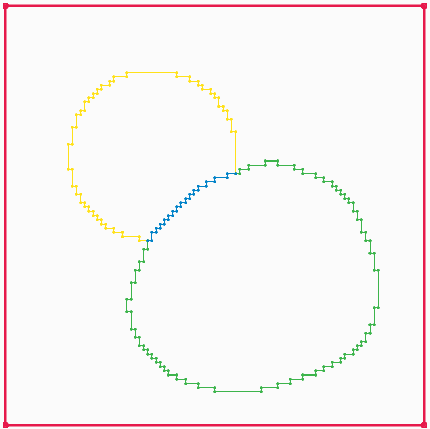
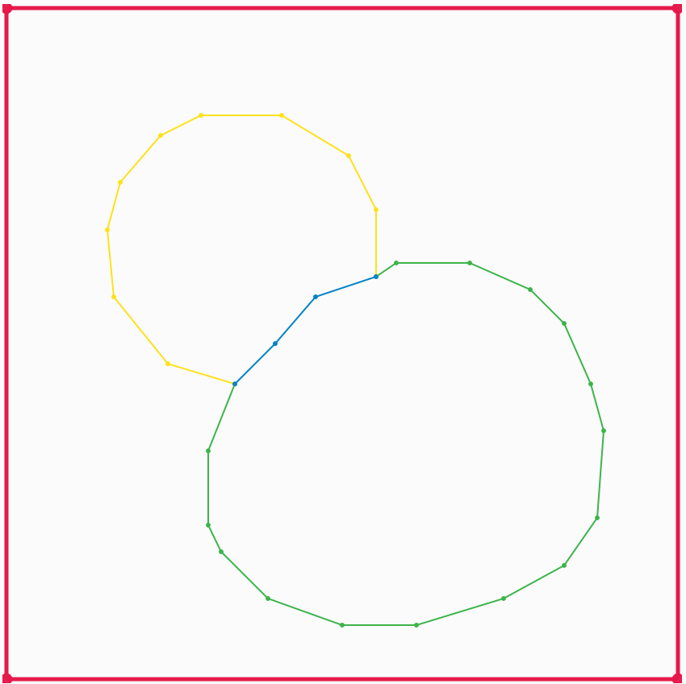
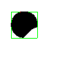
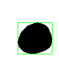
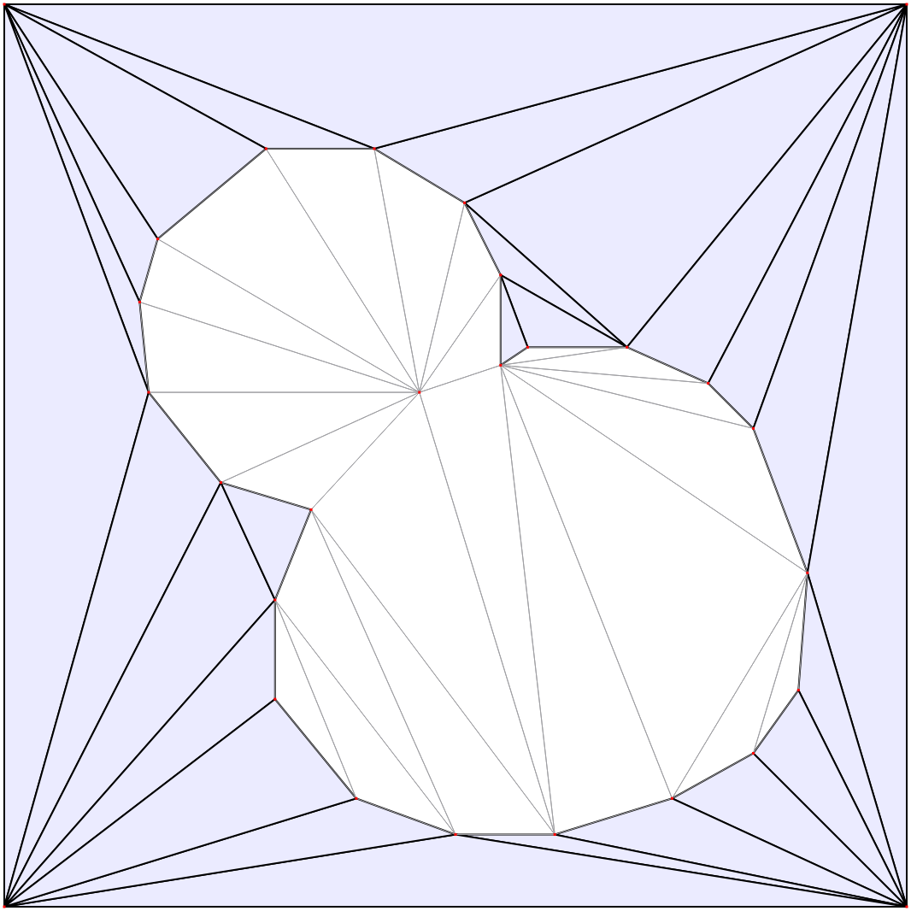
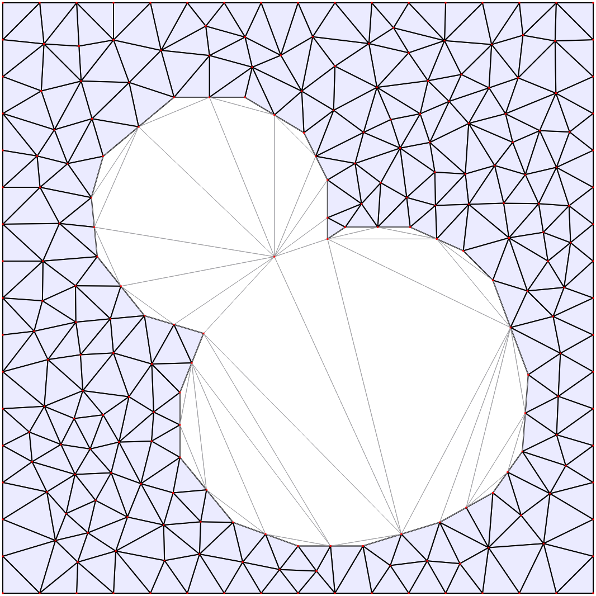
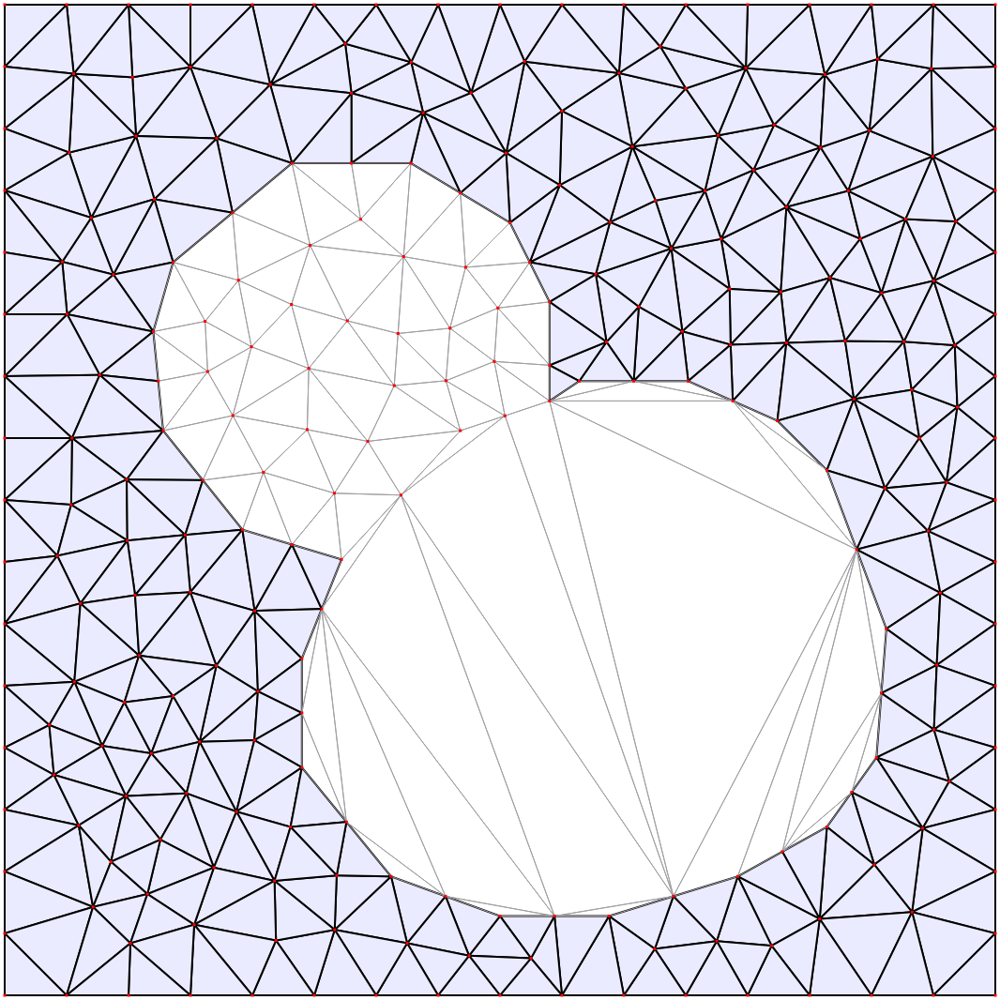
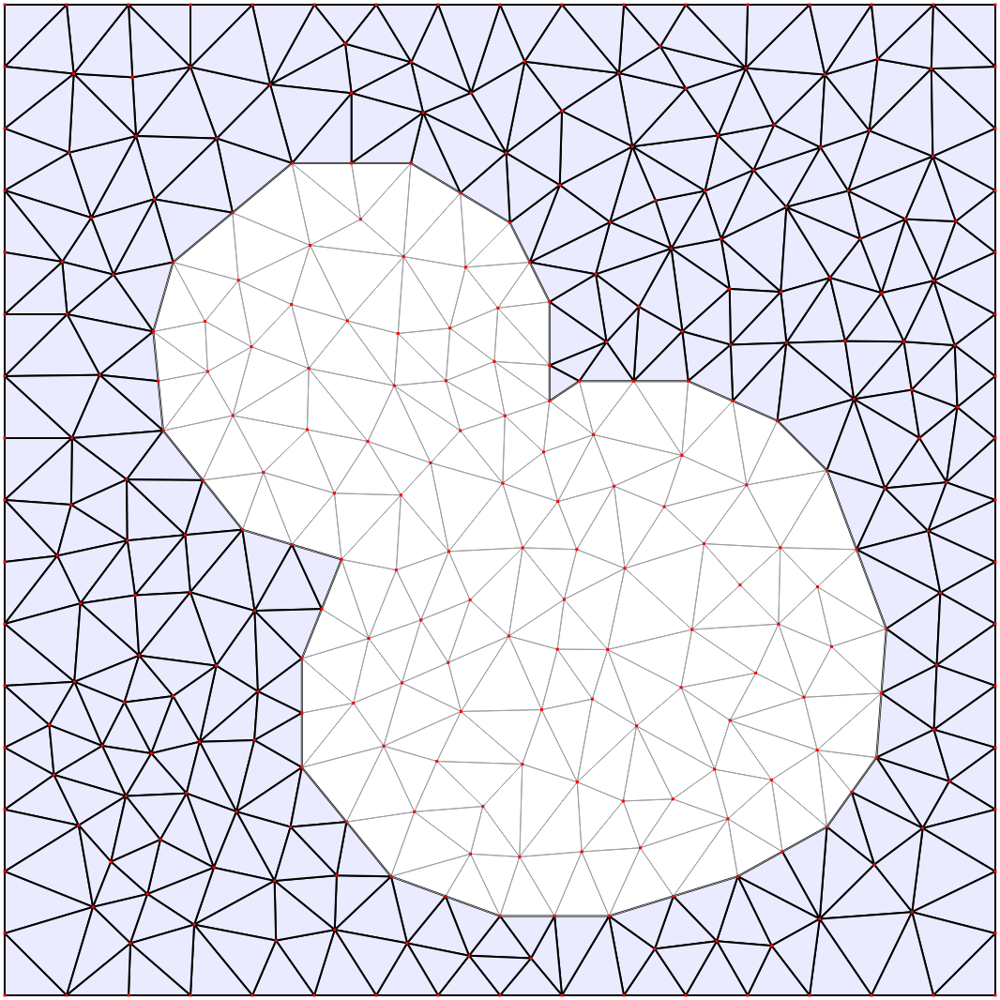

Mesh generation
===============

Generating a triangular mesh for the dune-copasi solver from a pixel image of the compartment geometry involves multiple steps:

* `Pixel contours`_
* `Pixel-Edge contours`_
* `Boundary line simplification`_
* `Interior points`_
* `Triangulation`_
* `Mesh refinement`_

These steps are described in more detail below, starting from this initial segmented image of the model geometry to illustrate each stage:

.. figure:: img/mesh_original_image.png
   :alt: Initial segmented geometry image

   Initial segmented geometry image.

Pixel contours
--------------

The first step in generating the mesh is to identify the set of contours that make up the boundaries of each
compartment, as well as the boundary between the model geometry (i.e. all the compartments) and the outside.

The contour tracing is done using the
`findContours <https://docs.opencv.org/4.5.1/d3/dc0/group__imgproc__shape.html#gae4156f04053c44f886e387cff0ef6e08>`_
function from the `OpenCV <https://opencv.org/>`_ library, which implements the method described in
`Suzuki et. al. <https://www.sciencedirect.com/science/article/abs/pii/0734189X85900167>`_.
This method returns an ordered, closed loop of 8-connected pixels for each contour.
Each compartment has at least one contour around its outer boundary,
and it may also contain inner contours around any holes in the compartment shape.
Outer contours trace an outer boundary of a compartment in an anti-clockwise direction,
while the inner contours trace an inner boundary of a compartment in a clockwise direction.
All the pixels used to construct the contours lie within the compartment.

.. figure:: img/mesh_pixel_contours.png
   :alt: Pixel Boundary contours

   Pixel Boundary contours.

Pixel-Edge contours
-------------------

If our compartments were all independent closed loops, then we could directly use the pixel contours
to construct the compartment boundaries, and simplify each contour independently.
However, once two compartments touch this is no longer the case, as we have to ensure that the part of each contour
that is shared between the two compartments is simplified in the same way, to avoid creating gaps between the compartments.

To deal with this, we construct a 4-connected contour of outer pixel edges from each 8-connected pixel contour.
If the image has width `W` and height `H`, then the vertices of the edge contours are located on
a grid of width `W+1` and height `H+1`, where the `(0,0)` vertex corresponds to the top-left corner of the `(0,0)` pixel.
The advantage of this contour representation is that if the outer part of two pixel contours are adjacent to each other, their
outer pixel-edge contours will coincide, which allows us to identify shared sub-contours unambiguously.
Vertices where three different contours intersect are identified and used to split the contours into lines which separate pairs of
adjacent compartments, and duplicates are removed.

   Split pixel-edge boundary contours.

Boundary line simplification
----------------------------

Once we have identified all of our boundaries, we want to simplify them by removing points from the boundary.
There are two ways of doing this. The default one is
`Visvalingam-Whyatt polyline simplification <https://www.tandfonline.com/doi/abs/10.1179/000870493786962263>`_,
which allows each boundary line to be independently simplified.
The algorithm starts by calculating the area of the triangle formed by each point on the boundary with its two nearest neighbouring points.
Then at each step:

* the point with the smallest area is removed
* the two neighbouring points areas are recalculated
* the larger of the previous and the new area is used

This allows us to order the points in the boundary by their order of importance,
and then the user can adjust the number of points used for each boundary as desired.

An alternative `topology-preserving polyline simplification <https://doc.cgal.org/latest/Polyline_simplification_2>`_
method is also available. This simplifies all the lines simultaneously
with the constraint that no new intersections are created, or in other words without any of the simplified boundary lines crossing each other.
This method can be useful for very complicated geometry images with many boundary lines, where manually adjusting the number
of points for each line would be impractical.

   Simplified boundary lines.

Interior points
---------------

Each connected region of pixels in a compartment needs an interior point to be specified to identify the region
during triangulation. An interior point is determined for each connected region by repeatedly eroding a binary image
of the region until all pixels are gone, then taking one of the remaining pixels from the previous step.

It is important that the interior point is as far as possible from any of the boundaries of the compartment,
to ensure that it remains within these boundaries even when they are simplified, so that the compartment that
corresponds to the region is correctly identified during triangulation.

The connected regions are identified using the

The animations below show how the algorithm works, which uses the
`connectedComponents() <https://docs.opencv.org/4.5.1/d3/dc0/group__imgproc__shape.html#gaedef8c7340499ca391d459122e51bef5>`_
and `erode() <https://docs.opencv.org/4.5.1/d4/d86/group__imgproc__filter.html#gaeb1e0c1033e3f6b891a25d0511362aeb>`_
functions from the `OpenCV <https://opencv.org/>`_ library

Meaning of the colors used in the animations:

* grey area: original connected region pixels
* black area: remaining pixels after previous erosion operations
* green rectangle: region of interest where the next erosion operation will be applied
* red dot: current interior point

Triangulation
-------------

The set of boundaries is then triangulated using the
`2D Conforming Triangulations and Meshes <https://doc.cgal.org/latest/Mesh_2/index.html>`_
package from the `CGAL <https://www.cgal.org/>`_ library.
This generates a constrained conforming Delaunay triangulation (CCDT) from the boundary lines
and interior points.

   Initial triangulation.

Mesh refinement
---------------

The mesh is then constructed from the triangulation using
`Delauney refinement <https://doc.cgal.org/latest/Mesh_2/index.html#secMesh_2_criteria>`_,
which inserts points inside the compartment as far away as possible from the existing points,
and triangulates them. It continues this until the minimum triangle angle is sufficiently large,
and the maximum triangle area is sufficiently small.
The minimum required angle is fixed to the largest value for
which the algorithm is guaranteed to succeed.
The maximum allowed triangle area for each compartment can be specified by the user.
If necessary points will also be added to the boundary lines (known as Steiner points).

   Final mesh.
