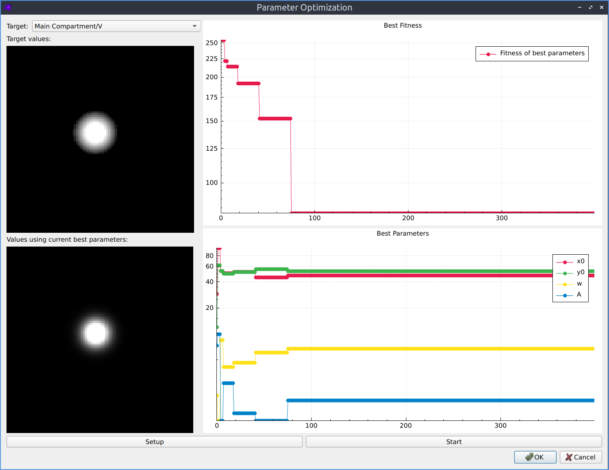
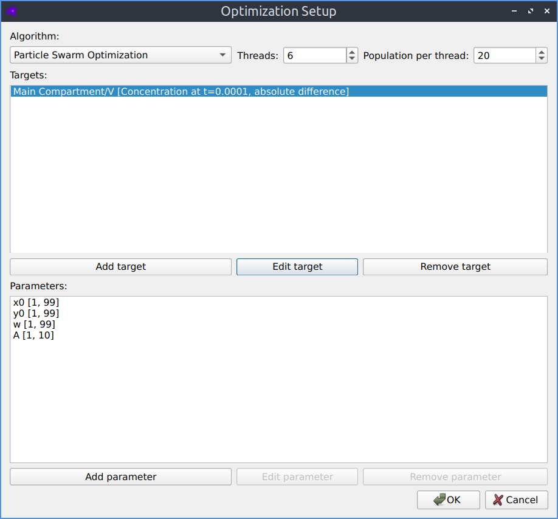
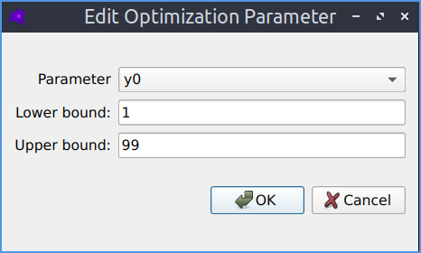
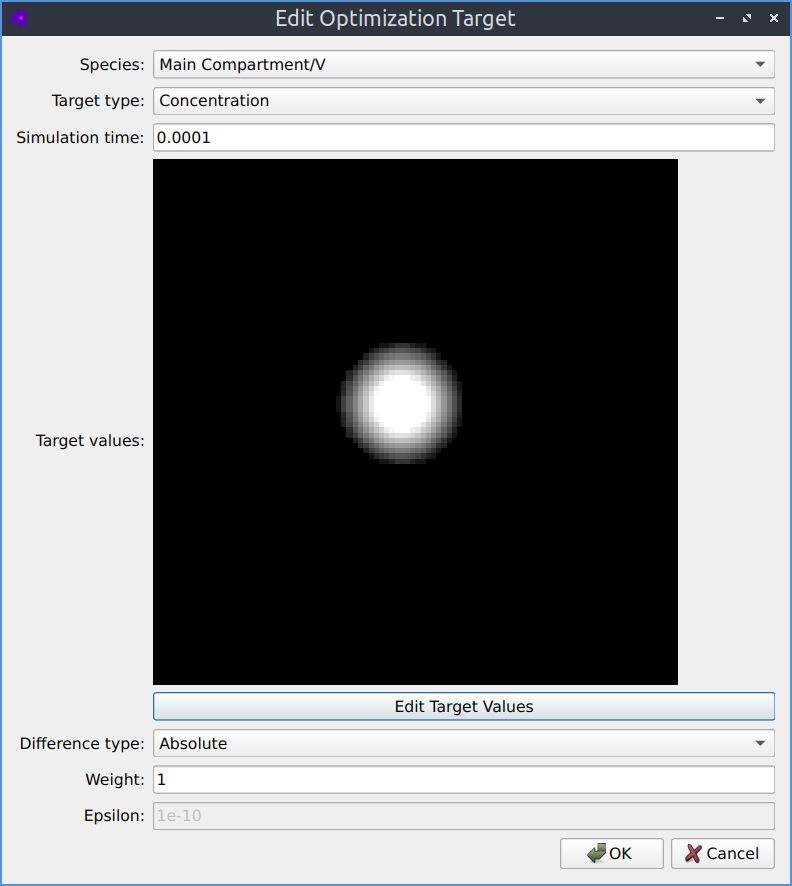
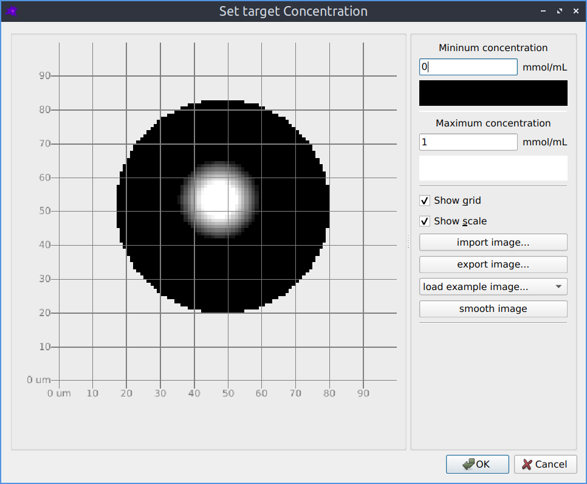

Parameter optimization
======================

To start parameter optimization, click on `Tools->Optimization`,
or use the keyboard shortcut `Ctrl+P`.

The parameter optimization interface displays a history of the best
set of parameters and their fitness, along with images of the optimization targets
(species concentrations or concentration rate of changes) compared with the
resulting values from the current best set of parameters.

   The parameter optimization interface.

* Targets and results (left side)
   * If you have multiple targets, you can choose which one to display from the dropdown list
   * The upper image shows the target concentration (or concentration rate of change) values
   * The lower image shows the actual values from the simulation using the current best set of parameters
* Fitness and parameters (right side)
   * The upper plot shows the history of fitness values during the optimization (lower is better)
   * The lower plot shows the history of the best set of parameters for at each optimization iteration
* Setup
   * Click the `Setup` button to change the optimization settings
   * See the :ref:`opt-setup` section for more details
* Start
   * Click the `Start` button to start optimizing
   * You can stop and continue optimization

When you are happy with your parameters you can press `Stop` and then `OK`.
You will then be asked if you want to apply the best parameters found during optimization to your model.
The optimization settings (but not any existing optimization history or results) are also saved in the model.

.. _opt-setup:

Optimization Setup
------------------

   Parameter optimization setup.

* Algorithm
   * Choose which optimization algorithm to use
   * See the `Pagmo algorithms <https://esa.github.io/pagmo2/docs/cpp/cpp_docs.html#implemented-algorithms>`_ documentation for more details about the available algorithms
* Threads
   * The number of populations to evolve in parallel
   * Typically this would be equal to the number of available CPU cores
* Population
   * The population size to evolve on each thread
   * Typically the more parameters are being optimized the larger this should be
* Targets
   * A list of target concentrations (or rate of change of concentrations) to optimize for
   * See the :ref:`opt-target` section for more details
* Parameters
   * A list of parameters to optimize
   * See the :ref:`opt-param` section for more details

.. _opt-param:

Optimization Parameter
----------------------

   Adding or modifying a parameter to be optimized.

* Parameter
   * This can be a model parameter or a reaction parameter
* Lower bound
   * The minimum allowed value this parameter can take
* Upper bound
   * The maximum allowed value this parameter can take

.. _opt-target:

Optimization Target
----------------------

   Adding or modifying a target to optimize for.

* Species
   * The species to target
* Target type
   * Either the concentration, or the concentration rate of change
* Simulation time
   * The timepoint in the simulation when this target should apply
* Target values
   * The desired spatial distribution of values
   * If not specifying this defaults to zero everywhere in the compartment
   * See the :ref:`opt-target-conc` section for more details
* Difference type
   * How to compare the target :math:`t` with the results :math:`r`
   * Absolute: :math:`|r - t|`
   * Relative: :math:`|r - t|/|t + \epsilon|`
* Weight
   * The relative importance of this target
   * The cost function for this target is multiplied by this weight
   * Only relevant when there are multiple targets
* Epsilon
   * The :math:`\epsilon` parameter in the relative difference measure
   * Avoids infinities caused by dividing by zero

.. _opt-target-conc:

Optimization Target Image Import
--------------------------------

   Importing a target species concentration from an image.

The spatial distribution of the target concentration
or rate of change of concentration can be imported from a grayscale
image in the same way as initial species concentrations.

* Minimum concentration
   * The concentration corresponding to a black pixel in the image
* Maximum concentration
   * The concentration corresponding to a white pixel in the image

More information
----------------

* On each thread, a separate optimization is performed
* Within each thread, each item in the population has a value for each parameter being optimized
* It also has a `fitness`, which is the sum of the differences between each target and the corresponding result
* With each optimization iteration, the parameters are evolved to improve (reduce) this `fitness` value
* This means each iteration requires `threads` * `population` simulations of the model
* The `algorithms <https://esa.github.io/pagmo2/docs/cpp/cpp_docs.html#implemented-algorithms>`_ are all `derivative free` optimization methods
