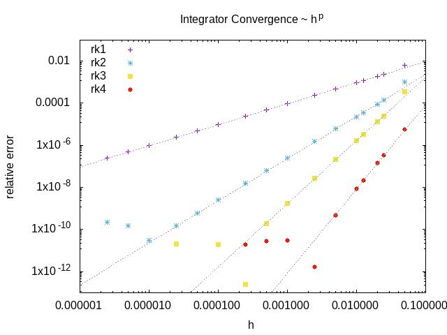
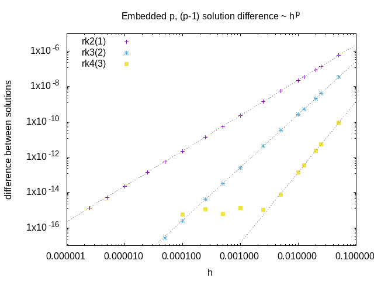
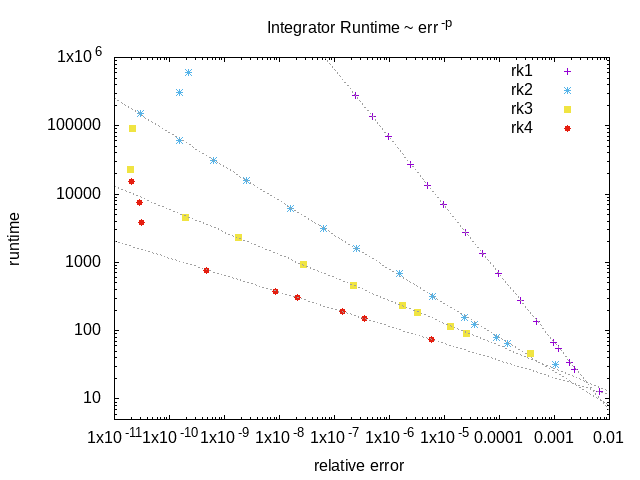

Pixel simulator
===============

This is an alternative PDE solver which uses the simple `FTCS <https://en.wikipedia.org/wiki/FTCS_scheme>`_ method to provide quick but potentially unreliable results.

Spatial discretization
----------------------

Space is discretized using a uniform, linear grid with spacing :math:`a`. The concentration is defined as a 2d array of values :math:`c_{i,j}`, where the value with index :math:`(i,j)` corresponds to the concentration at the spatial point :math:`(x = ia, y = ja)`.

The Laplacian is approximated on this grid using a central difference scheme

.. math::

   \left( \frac{\partial^2}{\partial x^2} + \frac{\partial^2}{\partial y^2} \right) c_{i,j} = \left[ c_{i+1,j} + c_{i,j+1} - 4 c_{i,j} + c_{i-1,j} + c_{i,j-1} \right] / a^2 + \mathcal{O}(a^2)

which has :math:`\mathcal{O}(a^2)` discretisation errors. Inserting this approximation into the reaction-diffusion equation converts the PDE into a system of coupled ODEs.

Time integration
----------------

Time integration is performed using explicit Runge-Kutta integrators. Compared to implicit integrators, they are easier to implement and offer better performance (for the same timestep). However they become unstable if the timestep :math:`h` is made too large, so in practice they can end up being slower than implicit methods for stiff problems, where the timestep is forced to be very small to maintain stability.

These integrators have three sources of error:

* Round-off error due to finite precision
   * mostly only relevant for high order solvers: not relevant here
* Truncation error due to finite order of integration scheme
   * we are generally forced by the diffusion term to make the timestep small to maintain stability
   * no benefit to having time integration errors significantly smaller than the spatial discretisation errors
   * so this is also typically not a concern
* Numerical instability of integrator
   * a problem when ODEs become stiff, e.g. high rate of diffusion, stiff reaction terms
   * this is our main concern

Solvers differ in their:

* order of truncation error
* order of embedded error estimate (if any)
* number of stages (i.e. cost of a step)
* region of stability (can be increased by adding more stages)
* memory requirements

Implemented solvers:

* Forwards Euler
   * 1st order solution
   * no error estimate
   * 1 stage
* Embedded Heun / modified Euler
   * 2nd order solution
   * 1st order error estimate
   * 2 stages
   * see e.g. eq(2.15) of https://doi.org/10.1016/0021-9991(88)90177-5
* Embedded Shu-Osher
   * 3rd order solution
   * 2nd order error estimate
   * 3 stages
   * see eq(2.17) of https://doi.org/10.1016/0021-9991(88)90177-5
* RK4(3)5[3S*]
   * 4th order solution
   * 3rd order error estimate
   * 5 stages
   * see alg.6 & tab.6 of https://doi.org/10.1016/j.jcp.2009.11.006

   An example of the convergence of the included RK integrators: relative error of the solution at a particular pixel as a function of the stepsize.

Adaptive timestep
-----------------

We use the embedded lower order solution to estimate the error, and from this adapt the stepsize during the integration. There are many ways to do this, and some experimentation will be necessary to find settings that are robust, but the current scheme is the following

* RK gives us a pair of :math:`u_{n+1}^{(p)} = u_{n} + \mathcal{O}(h^{p+1})` solutions
* difference between :math:`p, p-1` solutions gives *local* error of order `\mathcal{O}(p)`
* to get the relative error we divide this by the *local* concentration
   * to avoid dividing by zero, we approximate this by :math:`c = ( |c_{n+1}| + |c_{n}| + \epsilon)/2`
   * i.e. the average of the old and new concentration, plus a (hopefully) small constant
* we do this for all species, compartments and spatial points, and take the maximum value
* if the error was larger than the desired value, the step is discarded
* the new timestep is given by :math:`0.98 dt_{old} (err_{desired}/err_{measured})^{1/p}`
   * where the 0.98 factor is slightly less than 1 since we are neglecting higher order terms
   * better to have a slightly smaller timestep than to repeat the whole step

   An example of the difference between order p and order p-1 solutions from embedded schemes as a function of the stepsize. This quantity is a measure of the local integration error, and scales like :math:`h^p`

Maximum timestep
----------------

For the forwards Euler solver, we don't have an estimate of the error, so we can't automatically adjust the stepsize. However, if we ignore the reaction terms, there is an analytic upper bound on the size of timestep that can be used for forwards Euler, above which the system becomes unstable:

.. math::

   \delta t \leq \frac{a^2}{4 D}

So if the user selects a timestep larger than this, the simulator automatically reduces it to the above value to avoid the system becoming unstable. Note that the system can still become unstable if the reaction terms are stiffer than the diffusion terms.

   An example of the runtime of the RK integrators as a function of the relative error on the final solution.

Boundary Conditions
-------------------

The boundary condition for all boundaries is the "zero-flux" Neumann boundary condition. This is implemented in the spatial discretization by setting the concentration in the neighbouring pixel that lies outside the compartment boundary to be equal to the concentration in the boundary pixel value, or equivalently by setting the neighbour of each boundary pixel to itself.

Compartments
^^^^^^^^^^^^

Each compartment is discretized, with the above boundary conditions applied for the diffusion term.

Membranes
^^^^^^^^^

Reactions that take place between two compartments involve a flux across the membrane separating the two compartments. For each neighbouring pair of pixels from the two compartments, whose common boundary constitutes the membrane, the flux term is converted into a reaction term that creates or destroys the appropriate amount of species concentration in each pixel.

Non-spatial species
^^^^^^^^^^^^^^^^^^^

A species can be 'non-spatial', which means that at each timestep, its time derivative is calculated as normal at each point in the compartment, but is then spatially averaged over the whole compartment. This can be used to approximate a species with a very high diffusion constant without requiring a correspondingly tiny timestep to maintain the stability of the solver.
