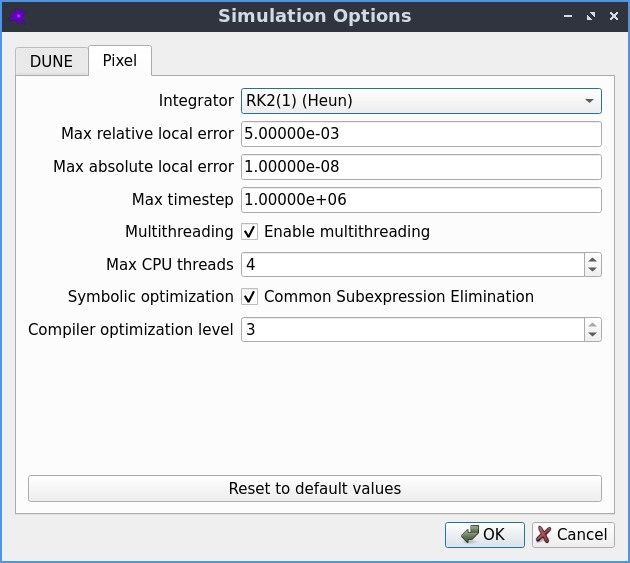

Pixel simulator
===============

Pixel is an alternative PDE solver which uses the simple `FTCS <https://en.wikipedia.org/wiki/FTCS_scheme>`_ method to solve the PDE using the pixels of the geometry image as the grid.

Simulation options
------------------

The default settings should work well in most cases, but if desired they can be adjusted by going to `Advanced->Simulation options`

   The simulation options that can be used to fine tune-the Pixel solver.

* Integrator
   * the explicit Runge-Kutta integration scheme used for time integration
   * default: 2nd order Heun scheme, with embedded 1st order error estimate
   * a higher order scheme may be more efficient if the maximum allowed error is very small
   * see the :ref:`time-integration` section for more information on the integrators
* Max relative local error
   * the maximum relative error allowed on the concentration of any species at any pixel
   * default: 0.005
   * local means the estimated error for a single timestep, at a single point
   * relative means each error estimate is divided by the species concentration
   * making this number smaller makes the simulation more accurate, but slower
* Max absolute local error
   * the maximum error allowed on the concentration of any species at any pixel
   * default: infinite
   * local means the estimated error for a single timestep, at a single point
   * absolute means the error estimate is not normalised by the species concentration
   * making this number smaller makes the simulation more accurate, but slower
* Max timestep
   * the maximum allowed timestep
   * default: infinite
* Multithreading
   * if enabled, multiple CPU threads can be used
   * default: disabled
   * enabling this can make simulations of large models run faster
   * however it can also make small models run slower
* Max CPU threads
   * limit the maximum number of CPU threads to be used
   * default: unlimited
* Symbolic optimization
   * factor out common subexpressions when constructing the reaction terms
   * default: enabled
* Compiler optimization level
   * how much optimization is done when compiling the reaction terms
   * default: 3

Spatial discretization
----------------------

Space is discretized using a uniform, linear grid with spacing :math:`a`. The concentration is defined as a 2d array of values :math:`c_{i,j}`, where the value with index :math:`(i,j)` corresponds to the concentration at the spatial point :math:`(x = ia, y = ja)`.

The Laplacian is approximated on this grid using a central difference scheme

.. math::

   \left( \frac{\partial^2}{\partial x^2} + \frac{\partial^2}{\partial y^2} \right) c_{i,j} = \left[ c_{i+1,j} + c_{i,j+1} - 4 c_{i,j} + c_{i-1,j} + c_{i,j-1} \right] / a^2 + \mathcal{O}(a^2)

which has :math:`\mathcal{O}(a^2)` discretisation errors. Inserting this approximation into the reaction-diffusion equation converts the PDE into a system of coupled ODEs.

.. _time-integration:

Time integration
----------------

Time integration is performed using explicit Runge-Kutta integrators. Compared to implicit integrators, they are easier to implement and offer better performance (for the same timestep). However they become unstable if the timestep :math:`h` is made too large, so in practice they can end up being slower than implicit methods for stiff problems, where the timestep is forced to be very small to maintain stability.

Integrators differ in their:

* order of truncation error
* order of embedded error estimate (if any)
* number of stages (i.e. cost of a step)
* region of stability (can be increased by adding more stages)
* memory requirements

Implemented integrators:

* Euler
   * 1st order solution
   * no error estimate
   * 1 stage
   * see e.g. https://en.wikipedia.org/wiki/Euler_method
* Embedded Heun / modified Euler
   * 2nd order solution
   * 1st order error estimate
   * 2 stages
   * see e.g. eq (2.15) of https://doi.org/10.1016/0021-9991(88)90177-5
* Embedded Shu-Osher
   * 3rd order solution
   * 2nd order error estimate
   * 3 stages
   * see eq (2.17) of https://doi.org/10.1016/0021-9991(88)90177-5
* RK4(3)5[3S*]
   * 4th order solution
   * 3rd order error estimate
   * 5 stages
   * see alg.6 & tab.6 of https://doi.org/10.1016/j.jcp.2009.11.006

.. figure:: img/convergence.png
   :alt: convergence of the RK integrators

   An example of the convergence of the included RK integrators: relative error of the solution at a particular pixel as a function of the stepsize.

These integrators have three sources of error:

* Round-off error due to finite precision
   * mostly only relevant for high order solvers: not relevant here
* Truncation error due to finite order of integration scheme
   * we are generally forced by the diffusion term to make the timestep small to maintain stability
   * also no benefit from making the time integration errors significantly smaller than the spatial discretisation errors
   * so this is also typically not a concern
* Numerical instability of integrator
   * a problem when ODEs become stiff, e.g. high rate of diffusion, stiff reaction terms
   * avoiding these instabilities is our main concern

Adaptive timestep
-----------------

We use the embedded lower order solution to estimate the error at each timestep, and use this to adapt the stepsize during the integration:

* RK gives us a pair of :math:`u_{n+1}^{(p)} = u_{n} + \mathcal{O}(h^{p+1})` solutions
* difference between :math:`p, p-1` solutions gives local error of order :math:`\mathcal{O}(p)`
* to get the relative error we symbolicDivide this by :math:`c = ( |c_{n+1}| + |c_{n}| + \epsilon)/2`
* we use the average of the old and new concentration, plus a small constant, to avoid dividing by zero
* we do this for all species, compartments and spatial points, and take the maximum value
* if this error is larger than the desired value, the whole step is discarded
* the new timestep is given by :math:`0.98 dt_{old} (err_{desired}/err_{measured})^{1/p}`
* the 0.98 factor is slightly less than 1 to account for the higher order terms that are neglected here
* it is better to have a slightly smaller timestep than to have to repeat the whole step

.. figure:: img/embedded.png
   :alt: difference between solutions of different order from embedded schemes

   An example of the difference between order p and order p-1 solutions from embedded schemes as a function of the stepsize. This quantity is a measure of the local integration error, and scales like :math:`h^p`

Maximum timestep
----------------

For the Euler method, we don't have an embedded lower order solution from which we can estimate of the error, so we can't automatically adjust the stepsize. However, if we ignore the reaction terms, there is an analytic upper bound on the size of timestep that can be used for Euler, above which the system becomes unstable:

.. math::

   \delta t \leq \frac{a^2}{4 D}

So if the user selects a timestep larger than this, the simulator automatically reduces it to the above value to avoid the system becoming unstable. Note that the system can still become unstable if the reaction terms are stiffer than the diffusion terms.

.. figure:: img/runtime.png
   :alt: runtime of the RK integrators

   An example of the runtime of the RK integrators as a function of the relative error on the final solution. The higher order integrators offer better performance if a very accurate solution is required, but at lower accuracy the lower order integrators are much faster.

Boundary Conditions
-------------------

The boundary condition for all boundaries is the "zero-flux" Neumann boundary condition. This is implemented in the spatial discretization by setting the concentration in the neighbouring pixel that lies outside the compartment boundary to be equal to the concentration in the boundary pixel value, or equivalently by setting the neighbour of each boundary pixel to itself.

Compartments
^^^^^^^^^^^^

Each compartment is discretized, with the above boundary conditions applied for the diffusion term.

Membranes
^^^^^^^^^

Reactions that take place between two compartments involve a flux across the membrane separating the two compartments. For each neighbouring pair of pixels from the two compartments, whose common boundary constitutes the membrane, the flux term is converted into a reaction term that creates or destroys the appropriate amount of species concentration in each pixel.

Membrane length
^^^^^^^^^^^^^^^

A first approximation to the length of the membrane is to simply count the number of pixel edges.
This tends to overestimate the length however, for example:

* a horizontal line of length :math:`n` has :math:`n` pixel edges
* a diagonal line of length :math:`n` has :math:`\sqrt(2) n` pixel edges

One way to improve the length estimate is to take into account the changes in direction
as the edges are traversed. Our boundaries are the exterior edges of a region of 8-connected pixels,
which makes our boundaries 4-connected. In this case, the changes in direction simplify to simply
counting the number of corners in the boundary.

We use the scheme proposed in section 3.B.(ii) of `10.1016/S0146-664X(79)80042-8 <https://doi.org/10.1016/S0146-664X(79)80042-8>`_,
which gives an improved estimate of the length as

.. math::

   L = 0.948 n - 0.278 n_c

Where :math:`n` is the number of pixel edges, and :math:`n_c` is the number of corners.

Converting this to a local re-weighting for each individual pixel edge,
each corner gives a half contribution to each of the two edges connected to it,
giving the following three possible weights for a pixel edge:

* 0.948: edge with no corners
* 0.809: edge with one corner
* 0.670: edge with two corners

Non-spatial species
^^^^^^^^^^^^^^^^^^^

A species can be 'non-spatial', which means that at each timestep, its time derivative is calculated as normal at each point in the compartment, but is then spatially averaged over the whole compartment. This can be used to approximate a species with a very high diffusion constant without requiring a correspondingly tiny timestep to maintain the stability of the solver.
