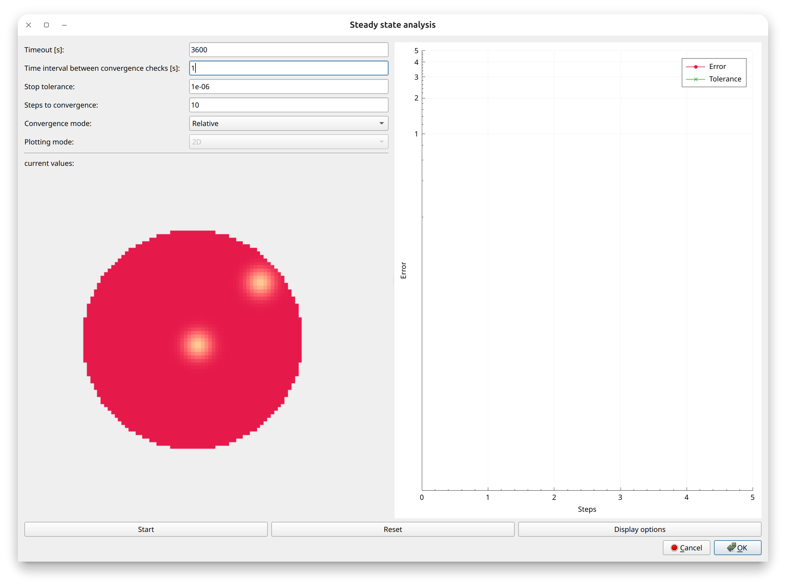

Steady state analysis
=====================

.. warning::
    This is in an early stage of implementation and currently has only limited functionality. The interface may change at any time. Performance is not fully optimised yet and meaningful results will, for now, rely on significant knowledge of the system to be solved and the chosen solver parameters. No custom observables are supported at the moment, at only a single steady state in the parameter space will be found at once.

   The steadystate analysis window.

*SME* provides a steady state analysis tool that can be used to find an attractive fixtpoint of the currently loaded model for the current parameters. It does this by using the existing solvers as pseudo-timestepping methods, which will run until the (possibly normalised) time derivative of the
concentrations does not change significantly anymore.
Because of this, you need to use the normal interfaces provided by the main window to change parameters of the model or any other properties of the solver or system.

Settings for steady state solvers
---------------------------------

The steady state analysis can be started from the GUI by selecting the menu item
``Steady state analysis`` in the ``Tools`` menu. This will open a new window with the following options, found on the top left side of the dialog:

* **Timeout**: The maximum time the solver will run for. This is useful to prevent the solver from running indefinitely. The default value is 3600 seconds = 1h.
* **Time interval between convergence checks**: A real-time interval, defaulting to 1 second. The solver runs during this interval, and once it has passed, the system checks if the change over this interval in the concentrations is above or below the given tolerance level.
* **Stop Tolerance**: The tolerance for the steady state analysis. This is the maximum allowed change in the concentrations between two consecutive iterations. The default value is 1e-6.
* **Steps to convergence**: The number of steps for which the rate of change of the concentrations has to stay below the stop tolerance before the solver is considered to have converged. The default value is 10.
* **Convergence mode**: Can be 'relative' or 'absolute'. In relative mode, the change in the concentrations is normalised by the current concentration. In absolute mode, the change is not normalised. The default value is 'relative'.
* **Plotting mode**: Can be '2D' or '3D'. In 2D mode, the concentrations are plotted as slices along the z-direction of a 3D image (one such slice if the the system is 2D). In 3D mode, the concentrations are plotted as a 3D image. The default value is '2D'.

Solver controls
---------------
Below this, the current concentrations are shown in a heatmap plot. In a 3D system plotted in 2D mode, you can use the z-axis below this to navigate along the z-direction of the domain.

To the right, the L2-norm (possibly normalised) of the current time derivative of the concentrations is shown. This is called 'error' in the GUI. Additionally, the stop tolerance is shown as a horizontal line. Initially, this may not be visible when it is far smaller than the error. This updates every step (as set by the time interval between convergence checks) and shows the current error and the stop tolerance, and can be used to monitor the convergence of the solver.

Finally, the buttons for starting, stopping and resetting the simulation as well as leaving the dialog are found below the plots. Additionally, you can use the *Display options* button to select different species to plot and different normalisation modes for the concentration image plot on the left. All this is much the same as for the normal simulation interface.
