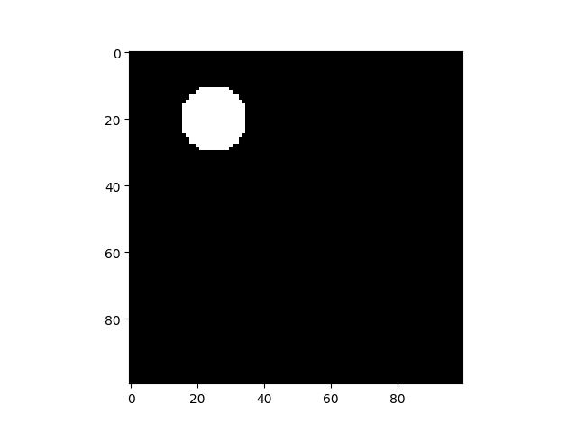
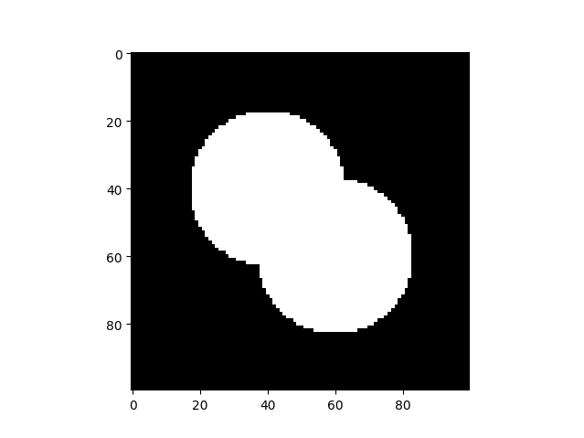
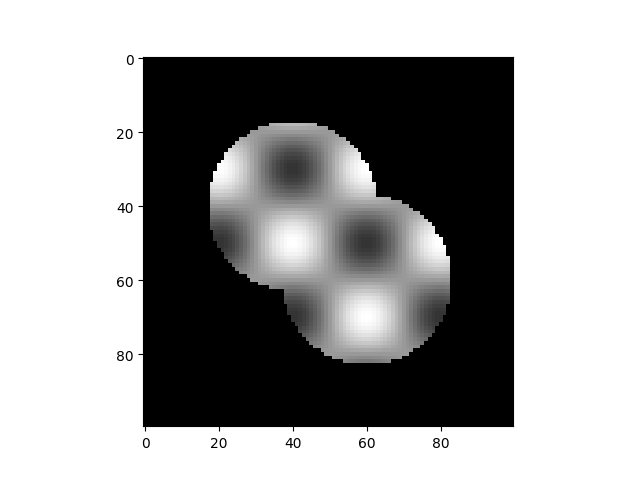

How to create your own geometry
===============================
*SME* can work with png images for 2D- and tiff images for 3D geometries. You can create these in whatever way you feel comfortable with. Here, we are going to use Python to create example geometries. We will use the `numpy <https://numpy.org/>`_ and `matplotlib <https://matplotlib.org/>`_ libraries to create a 2D geometry and save it as a png image. For the 3D tiff image, we will use
`tifffile <https://pypi.org/project/tifffile/>`_ which allows us to save a 3D array to a tiff image.

Create a 2D Geometry
--------------------
We first import the necessary models.

.. code-block:: python

    import numpy as np
    import matplotlib.pyplot as plt

Next, we create a 2D numpy array that represents the geometry. We will use a simple example of a 2D geometry with a circle in the middle.

.. code-block:: python

    # create a 2D numpy array
    size = 100
    x0 = 40
    y0 = 50
    r = 10
    geometry = np.zeros((size, size))
    for i in range(size):
        for j in range(size):
            # make a circle around (40, 50) with radius 10
            if (i - x0 // 2) ** 2 + (j - y0 // 2) ** 2 < r ** 2:
                geometry[i, j] = 1

Finally, we plot the geometry and save it as a png image.

.. code-block:: python

    # plot the geometry
    img = plt.imshow(geometry, cmap="gray")
    plt.axis("off")
    img.get_figure().savefig("2d_geometry.png", bbox_inches="tight", pad_inches=0)

    The resulting 2D geometry image with a circle in the upper left.

Create a 3D Geometry
--------------------
We follow the same steps as for the 2D geometry: We define the basic shape of the domain and then create functions that defines the various compartments in the domain. Here, we will create 2 spheres that intersect each other.
This time, we use `tifffile` instead of matplotlib:

.. code-block:: python

    import tifffile as tiff
    import numpy as np

Then, we create the 3D domain and the compartments.

.. code-block:: python

    arr = np.zeros((100, 100, 100))

    def sphere(x,y,z, x0=50, y0=50, z0=50, r=25):
        return (x-x0)**2 + (y-y0)**2 + (z-z0)**2 < r**2

    def compartment(x,y,z):
        return sphere(x, y, z, 40, 40, 40) or sphere(x, y, z, 60, 60, 60)

    for i in range(100):
        for j in range(100):
            for k in range(100):
                arr[i,j,k] = compartment(x,y,z)

Finally, we save the 3D geometry as a tiff image.

.. code-block:: python

    tiff.imwrite('/home/hmack/Seafile/project_resources/SME/3d_skewed_hourglass.tiff', arr)

    A slice at z=50 through the resulting 3D geometry created with the code above.

Create an image for initial conditions
---------------------------------------
You can use the same workflow to create images that can serve as initial conditions for a species in a certain compartment. To that end, we can add another function which computes the concentration field at each pixel of the image. The resulting array then can be stored as a png (2D) or tiff (3D) image and loaded into a model as described in `the section on reactions in the 'getting started' page <../quickstart/reactions.html>`_.

.. code-block:: python

    # same logic as before
    arr_init = np.zeros((100, 100, 100))

    def sphere(x,y,z, x0=50, y0=50, z0=50, r=25):
        return (x-x0)**2 + (y-y0)**2 + (z-z0)**2 < r**2

    def compartment(x,y,z):
        return sphere(x, y, z, 40, 40, 40) or sphere(x, y, z, 60, 60, 60)

    def init(x,y,z):
        return np.sin(np.pi*x/100) * np.sin(np.pi*y/100) + 1/100*z

    # 'compartment' is zero outside the inner compartment
    for i in range(100):
        for j in range(100):
            for k in range(100):
                arr_init[i,j,k] = compartment(x,y,z)*init(i,j,k)

    tiff.imwrite('/home/hmack/Seafile/project_resources/SME/3d_skewed_hourglass_init.tiff', arr_init)

    The initial condition at z=50 created with the code above.

In this code, we used the fact that the `compartment` function is zero outside the inner compartment and one inside. We then defined the initial condition as a function of the position in the compartment. This way, we can create an initial condition that is zero outside the compartment and has a certain shape inside.
More complex initial conditions can be readily created in this way by providing more complex functions for the compartment or initial conditions.
